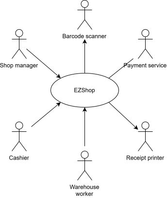
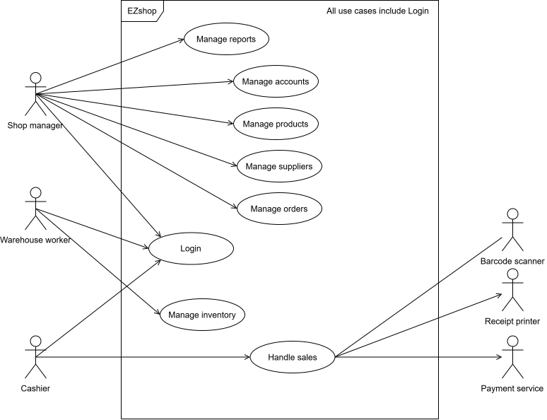
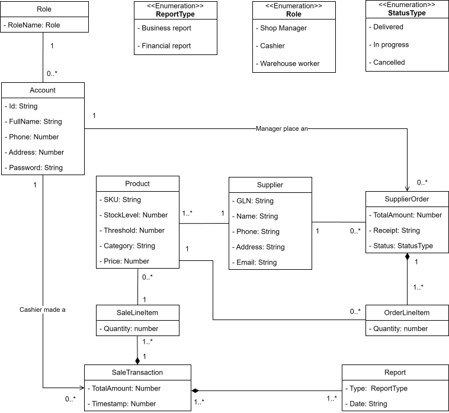
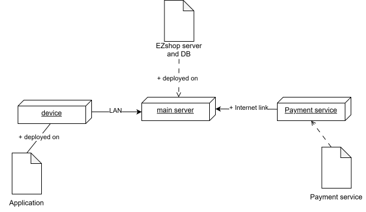

# Team 9: Software Engineering

Date: 20/10/2025

Version: 2.0.0

# Contents

- [Informal description](#informal-description)
- [Business Model](#business-model)
  - [Value Proposition](#value-proposition)
  - [Stakeholders](#stakeholders)
- [Context Diagram and interfaces](#context-diagram-and-interfaces)
  - [Context Diagram](#context-diagram)
  - [Actors](#actors)
  - [Interfaces](#interfaces)
- [Functional and non functional requirements](#functional-and-non-functional-requirements)
  - [Functional Requirements](#functional-requirements)
  - [Non Functional Requirement](#non-functional-requirement)
- [Table of rights](#table-of-rights)
- [Use case diagram and use cases](#use-case-diagram-and-use-cases)
  - [UC Briefs](#uc-briefs)
  - [Use case 1 – Login](#use-case-1-login)
  - [Use case 2 – Manage accounts](#use-case-2-manage-accounts)
  - [Use case 3 – Manage reports](#use-case-3-manage-reports)
  - [Use case 4 – Manage products](#use-case-4-manage-products)
  - [Use case 5 – Manage suppliers](#use-case-5-manage-suppliers)
  - [Use case 6 – Manage orders](#use-case-6-manage-orders)
  - [Use case 7 – Manage inventory](#use-case-7-manage-inventory)
  - [Use case 8 – Handle sales](#use-case-8-handle-sales)
- [Glossary](#glossary)
- [System Design](#system-design)
- [Hardware Software architecture](#hardware-software-architecture)

# Informal description

Small shops require a simple application to support the owner or manager. A small shop (ex a food shop) occupies 50-200 square meters, sells 500-2000 different item types, has two or a few more cash registers.
EZShop is a software application to:

- manage sales
- manage inventory
- manage orders to suppliers
- support accounting

In the following describe the requirements of the EZShop application.
You are free to define the application as you deem more useful and effective for the stakeholders.
You are also free to modify the structure of the document when needed.
The document will be evaluated considering the typical defects in requirements (omissions, ambiguities, contradictions, etc), and syntactic errors in the formalism used (UML diagrams).
Consider that the document should be delivered to another team (unknown to you)
which will be in charge of designing and implementing the system. The design team should be able to proceed only with the information in the document.

# Business Model

Our revenue model is designed to be _flexible_, providing a _low-barrier entry_ for small businesses while ensuring long-term, sustainable support. It is based on a primary product license with optional, recurring support plans.

1. **Perpetual License** (One-Time Payment)

   - This is the core purchase of the EZShop software. The company pays a one time fee to own and use the software indefinitely. The perpetual license also includes one year of free maintenance.

2. **Optional Maintenance & Support Plans** After the initial maintenance plan has expired, clients can choose a support plan that fits their needs:

   - **Monthly Support Subscription**: recurring fee that guarantees continuous software maintenance, all future updates (including new features and security patches), and priority technical support.

     > Best for: Established shops that rely on system stability and want predictable, ongoing support costs without unexpected fees.

   - **Pay-Per-Incident** Support: This plan has no recurring fee. The client pays a flat rate only when they require technical support or intervention.

     > Best for: Startups and very small companies that need to minimize the monthly fixed costs but still require the assurance of available professional help when a problem arises.

## Value Proposition

EZShop is an **affordable**, **all-in-one management solution** designed specifically for small shop owners seeking to **replace inefficient paper-based systems** with a modern, digital operation.

Our software maximizes **efficiency** and **profitability** by seamlessly integrating sales, inventory, supplier orders, and accounting support into one simple platform.

#### Key Benefits for Shop Owners:

- Start an **affordable transaction** from paper-base to modern solution at a price point small and medium company can afford.
- **Automation** is the key: it connects the Point-of-Sale system to the inventory, allowing the system to automatically flag low-stock items and display the contact information of potential suppliers.
- **Real-Time Business Insights**: The integrated dashboard provides real-time statistics on sales trends, best-selling products, and revenue. Using this, the manager can make data-driven decisions about business strategy, as well as generate detailed reports for accounting purposes.

## Stakeholders

| Stakeholder name |                                                         Description                                                          |
| :--------------: | :--------------------------------------------------------------------------------------------------------------------------: |
|    Shop owner    |                               The one that commissions the system. Full control on the system.                               |
|   Shop manager   | The one that evaluates business strategies based on the system analytics and takes final decisions on orders from suppliers. |
|     Cashier      |                                           The one that handles sales to customers.                                           |
| Warehouse worker |                         The one that updates warehouse stock upon deliveries through barcode scans.                          |
|     Supplier     |                                               The one that restocks the store.                                               |
|     Customer     |                                              The one that buys from the store.                                               |
| Payment service  |                                     The one that handles sales and orders' transactions.                                     |
|      SW Dev      |                                                   The system's developers.                                                   |
|    Accountant    |                                           Manages the company's financial records                                            |
| Barcode scanner  |                                 Optical devices that reads the barcode printed on a product                                  |
| Receipt printer  |                                 Used to print the sale receipts for customer or internal use                                 |

# Context Diagram and interfaces

## Context Diagram

  

### Actors

- Shop manager
- Cashier
- Warehouse worker
- Payment service
- Barcode scanner
- Receipt printer

## Interfaces

|      Actor       |    Logical Interface     |        Physical Interface         |
| :--------------: | :----------------------: | :-------------------------------: |
|   Shop manager   | Graphical User Interface |         Screen, keyboard          |
|     Cashier      | Graphical User Interface | Screen, keyboard, barcode scanner |
| Warehouse worker | Graphical User Interface |         Screen, keyboard          |
| Payment service  |   Internet connection    |                API                |
| Barcode scanner  |    Proprietary driver    |             Bluetooth             |
| Receipt printer  |    Proprietary driver    |             Bluetooth             |

# Functional and non functional requirements

## Functional Requirements

| ID       |      |       | Description                                                                                       |
| -------- | ---- | ----- | ------------------------------------------------------------------------------------------------- |
| **FR1**  |      |       | **Authentication and authorization**                                                              |
|          | 1.1  |       | Display the login form                                                                            |
|          | 1.2  |       | Logout the user from the system                                                                   |
|          | 1.3  |       | Ensure the password follows the NIST SP 800-63B policy                                            |
|          | 1.4  |       | Grant the access                                                                                  |
|          | 1.5  |       | Identify employee's role from id                                                                  |
|          | 1.6  |       | Display the change password form                                                                  |
|          |      |       |
| **FR2**  |      |       | **Manage Accounts**                                                                               |
|          | 2.1  |       | Display a list of all the accounts                                                                |
|          | 2.2  |       | CRUD operations on accounts                                                                       |
|          | 2.3  |       | Display the account creation form                                                                 |
|          |      |       |                                                                                                   |
| **FR3**  |      |       | **Manage accounting**                                                                             |
|          | 3.1  |       | Filter transactions on time period                                                                |
|          |      | 3.1.1 | Display the list of transactions                                                                  |
|          |      | 3.1.2 | Evaluate statistics                                                                               |
|          |      | 3.1.3 | Create report                                                                                     |
|          |      | 3.1.4 | Display the balance graphs                                                                        |
|          | 3.2  |       | Generate report file in a common format (.csv or .pdf)                                            |
|          |      | 3.2.1 | Export key financial reports to a common format (.csv or .pdf)                                    |
|          |      |       |                                                                                                   |
| **FR4**  |      |       | **Manage suppliers**                                                                              |
|          | 4.1  |       | Filter suppliers                                                                                  |
|          | 4.2  |       | Display the list of suppliers                                                                     |
|          | 4.3  |       | CRUD operations on suppliers                                                                      |
|          | 4.4  |       | Display supplier details form                                                                     |
|          | 4.5  |       | Verify that GLN is compliant with ISO/IEC 6523                                                    |
|          |      |       |                                                                                                   |
| **FR5**  |      |       | **Manage orders**                                                                                 |
|          | 5.1  |       | CRUD operations on orders from supplier                                                           |
|          | 5.2  |       | Notify about low stock for a certain product                                                      |
|          | 5.3  |       | Generate a suggested reorder list based on items that have fallen below their low-stock threshold |
|          | 5.4  |       | Display order summary                                                                             |
|          | 5.5  |       | Display the list of all the orders                                                                |
|          |      |       |                                                                                                   |
| **FR6**  |      |       | **Handle sales**                                                                                  |
|          | 6.1  |       | Start transaction                                                                                 |
|          | 6.2  |       | Add product to transaction by barcode scanner                                                     |
|          |      | 6.2.1 | Add product to a sale transaction by manual lookup (by name or SKU code)                          |
|          |      | 6.2.2 | Edit products quantity                                                                            |
|          | 6.3  |       | End transaction                                                                                   |
|          |      | 6.3.1 | Calculate the total amount of the sale including taxes                                            |
|          |      | 6.3.2 | Update the inventory stock                                                                        |
|          |      | 6.3.3 | Process the receipt                                                                               |
|          |      | 6.3.4 | Process the payment                                                                               |
|          | 6.4  |       | Save the transaction                                                                              |
|          |      | 6.4.1 | Update the store balance                                                                          |
|          |      |       |                                                                                                   |
| **FR7**  |      |       | **Manage product**                                                                                |
|          | 7.1  |       | CRUD operations on product                                                                        |
|          |      | 7.1.1 | Display new creation product form                                                                 |
|          |      | 7.1.2 | Generate a unique SKU code                                                                        |
|          | 7.2  |       | Apply discount                                                                                    |
|          | 7.3  |       | Remove discount                                                                                   |
|          | 7.4  |       | CRUD operations on product's supplier list                                                        |
|          | 7.5  |       | Display the list of all the products                                                              |
|          |      |       |                                                                                                   |
| **FR8**  |      |       | **Manage inventory**                                                                              |
|          | 8.1  |       | CRUD operations on inventory                                                                      |
|          | 8.2  |       | Decrease a certain product's stock                                                                |
|          | 8.3  |       | Provide a real-time search function for a user to view the current stock level of any item        |
|          |      |       |                                                                                                   |
| **FR9**  |      |       | **Manage refunds**                                                                                |
|          | 9.1  |       | Refund customer                                                                                   |
|          | 9.2  |       | Restock returned item                                                                             |
|          |      |       |                                                                                                   |
| **FR10** |      |       | **Logging**                                                                                       |
|          | 10.1 |       | Log each (successful and unsuccessful) authentication event.                                      |
|          | 10.2 |       | Log security breaches.                                                                            |
|          | 10.3 |       | Log financial transactions (sale, refund, supplier order).                                        |
|          | 10.4 |       | Log stock movement caused by deliveries, manual adjustments, or sales.                            |
| **FR11** |      |       | **I/O Operations**                                                                                |
|          | 11.1 |       | Read user input                                                                                   |
|          | 11.2 |       | Search for input in the database                                                                  |

## Non Functional Requirement

<!-- Describe constraints on functional requirements -->

|  ID  | Type (efficiency, reliability, ..) | Description                                                                                                                                                                                                                                                                                                                                                                               |                Refers to                |
| :--: | :--------------------------------: | :---------------------------------------------------------------------------------------------------------------------------------------------------------------------------------------------------------------------------------------------------------------------------------------------------------------------------------------------------------------------------------------- | :-------------------------------------: |
| NFR1 |              Security              | Each user can access only its role designated information; no external party may view any internal data. Each role can perform only the actions assigned to it. No more than 1 breach per year.                                                                                                                                                                                           |                FR1, FR10                |
| NFR2 |             Efficiency             | Database query response time of < 1 sec; Front-End response time < 100 ms; Constraints on primary memory size < 1 GB; Constraints on secondary memory size < 500 MB                                                                                                                                                                                                                       |       All functional requirements       |
|      |
| NFR3 |             Usability              | Users considered: adults 18–70 years old with average capability of using computers (users of PC since at least one year), average education level; Users should be able to use the application with minimal training (15 minutes)                                                                                                                                                        | All functional requirements except FR10 |
|      |
| NFR4 |            Portability             | The system should be able to be deployed on devices that support Python3                                                                                                                                                                                                                                                                                                                  |       All functional requirements       |
|      |
| NFR5 |            Reliability             | System downtime shall not exceed 15 minutes per month during business hours. On the front end max 10 defects per user per year. The system's live data storage must be resilient to a single disk drive failure without data loss. The system must ensure a Recovery Point Objective (RPO) of 24 hours by performing daily backups to a physically separate storage device (e.g., a NAS). |       All functional requirements       |
|      |
| NFR6 |            Availability            | The back end should be available 99.99% of the time. System shall be available during store opening hours (Mon–Sat, 08:30–20:30; Sun, 09:00-12:30);                                                                                                                                                                                                                                       |       All Functional requirements       |
|      |
| NFR7 |          Maintainability           | Adding a software function requires 16 ph, modifying it requires 10 ph, and removing it requires 5 ph. Fixing a defect requires 7 ph.                                                                                                                                                                                                                                                     |       All Functional requirements       |

# Table of rights

| Functional Requirements |               Name               |
| :---------------------: | :------------------------------: |
|           FR1           | Authentication and authorization |
|           FR2           |         Manage Accounts          |
|           FR3           |        Manage accounting         |
|           FR4           |         Manage suppliers         |
|           FR5           |          Manage orders           |
|           FR6           |           Handle sales           |
|           FR7           |          Manage product          |
|           FR8           |         Manage inventory         |
|           FR9           |          Manage refunds          |
|          FR10           |             Logging              |
|          FR11           |          I/O Operations          |

|      Actor       | FR1 | FR2 | FR3 | FR4 | FR5 | FR6 | FR7 | FR8 | FR9 | FR10 | FR11 |
| :--------------: | :-: | :-: | :-: | :-: | :-: | :-: | :-: | :-: | :-: | :--: | :--: |
|   Shop manager   | yes | yes | yes | yes | yes | yes | yes | yes | yes |  no  |  no  |
|     Cashier      | yes | no  | no  | no  | no  | yes | no  | no  | yes |  no  |  no  |
| Warehouse worker | yes | no  | no  | no  | no  | no  | no  | yes | no  |  no  |  no  |
| Payment service  | no  | no  | no  | no  | no  | yes | no  | no  | no  |  no  |  no  |
| Barcode scanner  | no  | no  | no  | no  | no  | yes | no  | no  | yes |  no  |  no  |
| Receipt printer  | no  | no  | no  | no  | no  | yes | no  | no  | yes |  no  |  no  |

# Use case diagram and use cases

## UC Briefs

|     UC name      |                    Goal                    |                                                                                                                        Description                                                                                                                         |
| :--------------: | :----------------------------------------: | :--------------------------------------------------------------------------------------------------------------------------------------------------------------------------------------------------------------------------------------------------------: |
|      Login       |    Authenticate and authorize the user     |                                                                                   Main actor: Employee   User accesses the system upon providing correct credentials                                                                                    |
| Manage accounts  |            Update account list             |                                                                                                Main actor: shop manager   Add, remove or edit an account                                                                                                |
| Manage products  |            Update products list            |                                                                                                Main actor: shop manager   Add, remove or edit a product                                                                                                 |
|  Create reports  |   generate business reports for analysis   |                                                                          Main actor: Shop manager   request and viewing reports on sales and inventory for accounting reasons                                                                           |
|   Handle sales   |       process a customer’s purchase        | Main actor: Cashier   Add products to the transaction. Calculate the total. Process the customer’s payment and forward the transaction to the receipt printer. This involves the external payment service, the barcode scanner and the receipt printer. |
| Manage suppliers |         View supplier information          |                                                           Main actor: Warehouse worker   Retrieving a list of suppliers or searching for specific supplier details (contacts, sold products)                                                            |
|  Manage orders   | Handle stock purchase orders with supplier |                                                                          Main actor: Warehouse worker   Insert new order. Update order’s status from on delivery to delivered                                                                           |
| Update inventory |     Adjust stock levels in the system      |                              Main actor: Warehouse worker   Update the quantity of stock items. It is an optional flow (<<Extends>>) that can occur during the Manage orders process (e.g., when a new order is received).                              |

## Use case diagram

  

## UCs

### Use case 1, Login

| Actors Involved: Cashier, warehouse worker, shop manager |                                                                                                           |
| :------------------------------------------------------: | :-------------------------------------------------------------------------------------------------------: |
|                       Precondition                       |                        The employee is not authenticated and they have an account.                        |
|                      Postcondition                       |                                    The employee can access the system.                                    |
|                     Nominal Scenario                     | The employee accesses the application's web app sign in page. Then accesses their role's designated page. |
|                         Variants                         |                                 1.2 First login, password update needed.                                  |
|                        Exceptions                        |                                  1.3 The username or password are wrong.                                  |

##### Nominal scenario 1.1 - Successful login

| Scenario 1.1  |                                Successful authentication                                 |
| :-----------: | :--------------------------------------------------------------------------------------: |
| Precondition  |                The employee is on the login page and has a valid account.                |
| Postcondition | The employee is correctly authenticated and redirected to their role-specific main page. |

Steps

| Step | Actor's action                             | System action                                                      | FR needed |
| :--- | :----------------------------------------- | :----------------------------------------------------------------- | :-------- |
| 1    | The employee accesses the login page.      | The system displays the login form.                                | FR1.1     |
| 2    | The employee enters username and password. | The system reads username and password.                            | FR11.1    |
| 3    | The employee selects "Login".              | The system validates the credentials against the account database. | FR11.2    |
| 4    |                                            | The system identifies the employee's role.                         | FR1.5     |
| 5    |                                            | The system logs the access.                                        | FR10.1    |
| 6    |                                            | The system grants the access.                                      | FR1.4     |

##### Scenario 1.2 - First login

| Scenario 1.2  |                                               First login                                               |
| :-----------: | :-----------------------------------------------------------------------------------------------------: |
| Precondition  | The employee is on the login page, has a valid account and hasn't yet modified the default credentials. |
| Postcondition |        The employee is correctly authenticated and redirected to their role-specific main page.         |

Steps

| Step |                    Actor's action                    |                           System action                            | FR needed |
| :--- | :--------------------------------------------------: | :----------------------------------------------------------------: | :-------: |
| 1    |        The employee accesses the login page.         |                The system displays the login form.                 |   FR1.1   |
| 2    | The employee enters username and temporary password. |               The system read username and password.               |  FR11.1   |
| 3    |            The employee selects "Login".             | The system validates the credentials against the account database. |  FR11.2   |
| 4    |                                                      |             The system identifies the employee's role.             |   FR1.5   |
| 5    |                                                      |           The system displays a "Change password" form.            |  FR 1.6   |
| 6    |         The employee chooses a new password.         |               The system validates the new password.               |  FR 1.3   |
| 7    |                                                      |             The system updates the employee's account.             |  FR 2.2   |
| 8    |                                                      |                    The system logs the access.                     |  FR 10.1  |
| 9    |                                                      |                   The system grants the access.                    |  FR 1.4   |

##### Exception scenario 1.3 - Invalid credentials

| Scenario 1.3  |          Invalid credentials          |
| :-----------: | :-----------------------------------: |
| Precondition  |  The employee is on the login page.   |
| Postcondition | The employee remains unauthenticated. |

Steps

| Step |                      Actor's action                      |                               System action                                | FR needed |
| ---- | :------------------------------------------------------: | :------------------------------------------------------------------------: | :-------: |
| 1    |          The employee accesses the login page.           |                    The system displays the login form.                     |  FR 1.1   |
| 2    | The employee inserts an incorrect username and password. |                  The system reads username and password.                   |  FR 11.1  |
| 3    |              The employee selects "Login".               | The system fails to validate the credentials against the account database. |  FR 11.2  |
| 4    |                                                          |                     The system logs the failed login.                      |  FR 10.2  |
| 5    |                                                          |                   The system displays an error message.                    |           |

### Use case 2, Manage accounts

| Actors Involved: Shop manager |                                                                                                     |
| :---------------------------: | :-------------------------------------------------------------------------------------------------: |
|         Precondition          |                               The shop manager must be authenticated.                               |
|        Post condition         |                              The list of system accounts is modified.                               |
|       Nominal Scenario        | The shop manager navigates through the account management section and successfully adds an account. |
|           Variants            |                      2.2 Edit an existing account   2.3 Delete an account.                       |
|          Exceptions           |                                2.4 Missing or invalid informations.                                 |

##### Nominal scenario 2.1 - Define a new account

| Scenario 2.1  |                       Define a new account                       |
| :-----------: | :--------------------------------------------------------------: |
| Precondition  |     A new employee has been hired and they need an account.      |
| Postcondition | A new account with a specific role is added to the account list. |

Steps

| Step |                         Actor's action                         |                   System action                    | FR needed |
| ---- | :------------------------------------------------------------: | :------------------------------------------------: | :-------: |
| 1    |            The manager selects "Add new employee".             | The system displays a form for adding new account. |  FR 2.3   |
| 2    | The manager fills the form (username, temp. password and role) |            The system reads user input.            |  FR 11.1  |
| 3    |                 The manager saves the account.                 | The system records a new account in the database.  |  FR 2.2   |
| 4    |                                                                | The system displays the updated list of accounts.  |  FR 2.1   |

##### Scenario 2.2 - Edit an existing account

| Scenario 2.2  |                                         Edit an existing account                                         |
| :-----------: | :------------------------------------------------------------------------------------------------------: |
| Precondition  |                An employee has changed one of their personal details (e.g. name, role...)                |
| Postcondition | The employee's existing account is modified according to the new directive and is saved to the database. |

Steps

| Step |                    Actor's action                     |                      System action                       | FR needed |
| ---- | :---------------------------------------------------: | :------------------------------------------------------: | :-------: |
| 1    | The manager requests a list of the existing accounts. |    The system displays the list of all the accounts.     |  FR 2.1   |
| 2    |     The manager chooses an account from the list.     |        The system displays the account's details.        |  FR 2.2   |
| 3    | The manager edits the fields that need to be changed. |               The system reads user input.               |  FR 11.1  |
| 4    |            The manager saves the account.             | The system updates the account's record in the database. |  FR 2.2   |

##### Scenario 2.3 - Delete an account

| Scenario 2.3  |                                       Delete an account                                        |
| :-----------: | :--------------------------------------------------------------------------------------------: |
| Precondition  |                       An employee has has to be removed from the system.                       |
| Postcondition | The employee's account is removed from the database and no longer appears in the account list. |

Steps

| Step |                      Actor's action                       |                                 System action                                 | FR needed |
| ---- | :-------------------------------------------------------: | :---------------------------------------------------------------------------: | :-------: |
| 1    |  The manager requests the list of the existing accounts.  |               The system displays the list of all the accounts.               |  FR 2.1   |
| 2    | The manager chooses the account that needs to be deleted. |                  The system displays the account's details.                   |  FR 2.2   |
| 3    |           The manager selects "Delete account".           |                    The system removes the user's account.                     |  FR 2.2   |
| 4    |                                                           | The system displays a success message and refreshes the list of the accounts. |           |

##### Exception 2.4 - Missing or invalid informations

| Scenario 2.5  |                Missing or invalid informations                 |
| :-----------: | :------------------------------------------------------------: |
| Precondition  |    An employee needs to change their personal informations.    |
| Postcondition | The employee's personal informations are successfully updated. |

Steps

|     |                      Actor's action                       |          System action           | FR needed |
| --- | :-------------------------------------------------------: | :------------------------------: | :-------: |
| 1   | The manager requests the list of the registered accounts. | Display the list of all accounts |  FR 2.1   |
| 2   | The manager chooses the account that needs to be updated. |    Show the account's details    |  FR 2.2   |
| 3   |        The manager edits the form in a wrong way.         |   The system reads user input.   |  FR 11.1  |
| 4   |              The manager saves the account.               |     An error message appears     |  FR 2.2   |

### Use case 3, Manage reports

| Actors Involved: Shop manager |                                                                                                                                               |
| :---------------------------: | :-------------------------------------------------------------------------------------------------------------------------------------------: |
|         Precondition          |                                                    The shop manager must be authenticated.                                                    |
|         Postcondition         |                                    A new report is generated and displayed on the screen of the computer.                                     |
|       Nominal Scenario        | The shop manager navigates through the generate report section, selects a report type, applies the desidred filters and generates the report. |
|           Variants            |                                                              3.2 Export reports.                                                              |
|          Exceptions           |                                                             3.3 No data is found.                                                             |

##### Nominal scenario 3.1 - Generate and visualize reports

| Scenario 3.1  |                          Generate and visualize reports                           |
| :-----------: | :-------------------------------------------------------------------------------: |
| Precondition  |                   The manager has navigated to the report page.                   |
| Postcondition | The system displays the requested statistics and graphs according to the filters. |

Steps

| Steps |                      Actor's action                      |                                                      System action                                                       |    FR needed     |
| ----- | :------------------------------------------------------: | :----------------------------------------------------------------------------------------------------------------------: | :--------------: |
| 1     |       The manager select "View sales statistics".        | The system prompts the user to choose the time period and the optional filters that will be used to generate the report. |                  |
| 2     | The manager selects the desired time period and filters. |                                               The system reads user input                                                |     FR 11.1      |
| 3     |         The manager selects "Generate reports".          |                      The system retrieves every sale transaction within the specified time period.                       | FR 3.1, FR 3.1.1 |
| 4     |                                                          |                                 The system processes the data to evaluate transactions.                                  |     FR 3.1.2     |
| 5     |                                                          |                                         The system displays the balance graphs.                                          |     FR 3.1.4     |

##### Scenario 3.2 - Export reports

| Scenario 3.2  |                                     Export reports                                      |
| :-----------: | :-------------------------------------------------------------------------------------: |
| Precondition  | The manager has navigated to the report page and the report has already been generated. |
| Postcondition |         A PDF or CSV report file of the previously generated report is created.         |

Steps

| Step | Actor's action                                          | System action                                                             | FR needed |
| ---- | ------------------------------------------------------- | ------------------------------------------------------------------------- | --------- |
| 1    | Same as Scenario 3.1, from step 1 to step 5.            |                                                                           |           |
| 2    | The manager selects the file format (`.pdf` or `.csv`). | The system generates a new report file according to the specified format. | FR 3.2    |
| 3    |                                                         | The system automatically exports the report file.                         | FR 3.2.1  |

##### Exception scenario 3.3 - No data found

| Exception scenario 3.3 |                     No data found                     |
| :--------------------: | :---------------------------------------------------: |
|      Precondition      |       The shop manager is generating a report.        |
|     Postcondition      | No report is generated and an error message is shown. |

Steps

| Step |                Actor's action                |                                   System action                                    | FR needed |
| ---- | :------------------------------------------: | :--------------------------------------------------------------------------------: | :-------: |
| 1    | Same as Scenario 3.1, from step 1 to step 3. |                                                                                    |           |
| 2    |                                              | The system displays an error message, saying that no transactions have been found. |           |

### Use case 4, Manage products

| Actors Involved: Shop manager |                                                                                              |
| :---------------------------: | :------------------------------------------------------------------------------------------: |
|         Precondition          |                           The shop manager must be authenticated.                            |
|        Post condition         |                         The system's products list has been updated.                         |
|       Nominal Scenario        | The shop manager navigates to the products list, chooses a product and applies some changes. |
|           Variants            |          4.2 Add a new product to the system.   4.3 Delete an existing product.           |
|          Exceptions           |                           4.4 The searched product does not exist.                           |

##### Nominal scenario 4.1 - Edit product's details

| Scenario 4.1  |            Edit product's details             |
| :-----------: | :-------------------------------------------: |
| Precondition  | The product is already present in the system. |
| Postcondition |  The product details are correctly updated.   |

Steps

| Step |                  Actor's action                   |                            System action                            | FR needed |
| ---- | :-----------------------------------------------: | :-----------------------------------------------------------------: | :-------: |
| 1    |   The manager enters the product's SKU or name.   | The system shows all the products that match the search parameters. |   FR7.5   |
| 2    | The manager chooses the product he wants to edit. |          The system shows the selected product's details.           |   FR7.1   |
| 3    |     The manager edits the product's details.      |                    The system reads user input.                     |  FR 11.1  |
| 4    |          The manager saves the changes.           |      The system updates the product's record in the database.       |  FR 7.1   |

##### Scenario 4.2 - Add a new product

| Scenario 4.2  |               Add a new product               |
| :-----------: | :-------------------------------------------: |
| Precondition  |   The product is not present in the system.   |
| Postcondition | The product is correctly added to the system. |

Steps

| Step |                       Actor's action                       |                                   System action                                    |    FR needed     |
| ---- | :--------------------------------------------------------: | :--------------------------------------------------------------------------------: | :--------------: |
| 1    |           The manager selects "Create product".            | The system displays the product creation form with an automatically generated SKU. | FR7.1.1, FR7.1.2 |
| 2    | The manager fills the form with the new product's details. |                            The system reads user input.                            |     FR 11.1      |
| 3    |           The manager selects "Add new product".           |            The system records the newly added product in the database.             |      FR7.1       |

##### Scenario 4.3 - Delete a product

| Scenario 4.3  |                 Delete a product                  |
| :-----------: | :-----------------------------------------------: |
| Precondition  |   The product is already present in the system.   |
| Postcondition | The product is correctly removed from the system. |

Steps

| Step |                    Actor's action                    |                           System action                            | FR needed |
| ---- | :--------------------------------------------------: | :----------------------------------------------------------------: | :-------: |
| 1    |    The manager enters the product's SKU or name.     | The system displays the products that match the search parameters. |   FR7.5   |
| 2    | The manager selects the product they want to delete. |          The system displays the product's informations.           |   FR7.1   |
| 3    |        The manager selects "Delete product".         |     The system removes the product's record from the database.     |   FR7.1   |

##### Exception scenario 4.4 - The searched product doesn't exist

| Exception scenario 4.4 |                      The searched product doesn't exist                      |
| :--------------------: | :--------------------------------------------------------------------------: |
|      Precondition      |                  The product is not present in the system.                   |
|     Postcondition      | The shop manager is informed that the searched product is not in the system. |

Steps

| Step |                Actor's action                 |                              System action                              | FR needed |
| ---- | :-------------------------------------------: | :---------------------------------------------------------------------: | :-------: |
| 1    | The manager enters the product's SKU or name. |   The system displays the products that match the search parameters.    |   FR7.5   |
| 2    |                                               | The system displays a message that says that no product has been found. |           |

### Use case 5, Manage suppliers

| Actors Involved: Shop manager |                                                                                                                     |
| :---------------------------: | :-----------------------------------------------------------------------------------------------------------------: |
|         Precondition          |                                       The shop manager must be authenticated.                                       |
|        Post condition         |                                    The system's suppliers list has been updated.                                    |
|       Nominal Scenario        | The manager navigates to the product list, chooses the supplier they want to edit and applies the desidred changes. |
|           Variants            |                                   5.2 Add a new supplier. 5.3 Delete a supplier.                                    |
|          Exceptions           |  5.4 The searched supplier does not exist.   5.5 An already existing GLN is being assigned to another supplier.  |

##### Nominal scenario 5.1 - Edit supplier's details

| Scenario 5.1  |            Edit supplier's details             |
| :-----------: | :--------------------------------------------: |
| Precondition  | The supplier is already present in the system. |
| Postcondition | The supplier's details are correctly updated.  |

Steps

| Step |                   Actor's action                    |                       System action                       | FR needed |
| ---- | :-------------------------------------------------: | :-------------------------------------------------------: | :-------: |
| 1    |   The manager enters the supplier's GLN or name.    | Display the suppliers that match the inserted GLN or name |   FR4.2   |
| 2    | The manager selects the supplier they want to edit. |                Display supplier's details                 |   FR4.3   |
| 3    |      The manager edits the supplier's details.      |               The system reads user input.                |  FR 11.1  |
| 4    |           The manager saves the changes.            | The system updates the supplier's record in the database. |   FR4.3   |

##### Scenario 5.2 - Add a new supplier

| Scenario 5.2  |               Add a new supplier               |
| :-----------: | :--------------------------------------------: |
| Precondition  |   The supplier is not present in the system.   |
| Postcondition | The supplier is correctly added to the system. |

Steps

| Step |                     Actor's action                      |                                System action                                 | FR needed |
| ---- | :-----------------------------------------------------: | :--------------------------------------------------------------------------: | :-------: |
| 1    |        The manager selects "add a new supplier"         |                 The system generates an empty supplier form.                 |   FR4.4   |
| 2    | The manager fills the form with the supplier's details. |                         The system reads user input.                         |  FR 11.1  |
| 3    |             The manager saves the changes.              |             The system verifies that the inserted GLN is valid.              |   FR4.5   |
| 4    |                                                         | The system creates a new record in the database with the supplier's details. |   FR4.3   |

##### Scenario 5.3 - Delete a supplier

| Scenario 5.3  |                   Delete a supplier                   |
| :-----------: | :---------------------------------------------------: |
| Precondition  |    The supplier is already present in the system.     |
| Postcondition | The supplier is successfully removed from the system. |

Steps

| Step |                  Actor's action                   |                           System action                           | FR needed |
| ---- | :-----------------------------------------------: | :---------------------------------------------------------------: | :-------: |
| 1    |  The manager enters the supplier's GLN or name.   | The system displays the suppliers that match the search criteria. |   FR4.2   |
| 2    | The manager selects supplier they want to delete. |            The system displays the supplier's details.            |   FR4.3   |
| 3    |             Select "Delete supplier".             |    The system deletes the supplier's record from the database.    |   FR4.3   |

##### Exception scenario 5.4 - Searched supplier doesn't exist

| Scenario 5.4  |                      Searched supplier doesn't exist                      |
| :-----------: | :-----------------------------------------------------------------------: |
| Precondition  |                The supplier is not present in the system.                 |
| Postcondition | Shop manager informed that the supplier of interest is not in the system. |

Steps

| Step |                 Actor's action                 |                               System action                                | FR needed |
| ---- | :--------------------------------------------: | :------------------------------------------------------------------------: | :-------: |
| 1    | The manager enters the supplier's GLN or name. |     The system displays the suppliers that match the search criteria.      |   FR4.2   |
| 2    |                                                | The system displays a message that says that no suppliers have been found. |           |

##### Exception scenario 5.5 - An already existing GLN is beign assigned to another supplier

| Scenario 5.5  |                       An already existing GLN is beign assigned to another supplier                       |
| :-----------: | :-------------------------------------------------------------------------------------------------------: |
| Precondition  | A new supplier is currently being added to the system or a supplier's details are currently being edited. |
| Postcondition |                    The shop manager is informed that the chosen GLN is already taken.                     |

Steps

| Step |              Actor's action              |                                                  System action                                                   | FR needed |
| ---- | :--------------------------------------: | :--------------------------------------------------------------------------------------------------------------: | :-------: |
| 1    | Same as Scenario 5.2, steps from 1 to 3. |                                                                                                                  |           |
| 2    |                                          | The system displays an error message saying that the inserted GLN has already been assigned to another supplier. |           |

### Use case 6, Manage orders

| Actors involved: Shop manager |                                                                                                                                                      |
| :---------------------------: | :--------------------------------------------------------------------------------------------------------------------------------------------------: |
|         Precondition          |                                                        The shop manager must be authenticated                                                        |
|         Postcondition         |                                                      The system's orders list has been updated.                                                      |
|       Nominal scenario        |                                          The shop manager places a new order and it's added to the system.                                           |
|           Variants            | 6.2 Edit an exising order's details   6.3 Edit a product's quantity in the current order.   6.4 Clear all the products from the current order. |
|          Exceptions           |                                                                                                                                                      |

##### Nominal scenario 6.1 - Add a new order

| Scenario 6.1  |                Add a new order                 |
| :-----------: | :--------------------------------------------: |
| Precondition  | The order has been processed by the supplier.  |
| Postcondition | The order is successfully added in the system. |

Steps

| Step |                       Actor's action                        |                     System action                     | FR needed |
| ---- | :---------------------------------------------------------: | :---------------------------------------------------: | :-------: |
| 1    |               The manager selects "products".               |          The system shows the products list.          |  FR 7.5   |
| 2    | The manager selects the products that need to be restocked. |  The system adds the products to the current order.   |  FR 5.1   |
| 3    |             The manager selects "current order"             |   The system displays the current order's summary.    |  FR 5.4   |
| 4    |             The manager enters a receipt code.              |             The system reads user input.              |  FR 11.1  |
| 5    |               The manager confirms the order.               | The system records the current order in the database. |  FR 5.1   |

##### Scenario 6.2 - Edit an existing order's details

| Scenario 6.1  |          Edit an existing order's details          |
| :-----------: | :------------------------------------------------: |
| Precondition  | The order has been previously added to the system. |
| Postcondition |   The order's details are successfully updated.    |

Steps

| Step |                                     Actor's action                                     |                            System action                             | FR needed |
| ---- | :------------------------------------------------------------------------------------: | :------------------------------------------------------------------: | :-------: |
| 1    | The manager searches the order they want to edit by inserting the supplier's GLN code. | The system displays all the orders that match de specified criteria. |  FR 5.5   |
| 2    |                         The manager selects the desired order.                         |        The system displays the details of the selected order.        |  FR 5.1   |
| 3    |                The manager edits the order's details (e.g. its status).                |                     The system reads user input.                     |  FR 11.1  |
| 4    |                             The manager saves the changes.                             |       The system updates the order's details in the database.        |  FR 5.1   |

##### Scenario 6.3 - Edit a product's quantity in the current order.

| Scenario 6.3  |  Edit a product's quantity in the current order.   |
| :-----------: | :------------------------------------------------: |
| Precondition  |      A new order is currently being defined.       |
| Postcondition | The changes are successfully applied to the order. |

Steps

| Step |             Actor's action              |                  System action                   | FR needed |
| ---- | :-------------------------------------: | :----------------------------------------------: | :-------: |
| 1    |  The manager selects "current order".   | The system displays the current order's summary. |  FR 5.4   |
| 2    | The manager edits a product's quantity. |    The system updates the product's quantity.    |  FR 5.1   |

##### Scenario 6.4 - Clear current order

| Scenario 6.4  |                Clear current order                |
| :-----------: | :-----------------------------------------------: |
| Precondition  |      A new order is currently being defined       |
| Postcondition | Products are correctly deleted from current order |

Steps

|     |     Actor's action     |             System action              | FR needed |
| --- | :--------------------: | :------------------------------------: | :-------: |
| 1   | Select "current order" |         Display order summary          |  FR 5.4   |
| 2   |     Select "clear"     | Remove all products from current order |  FR 5.1   |

### Use case 7, Manage inventory

| Actors involved: Warehouse worker |                                                            |
| :-------------------------------: | :--------------------------------------------------------: |
|           Precondition            |        The warehouse worker must be authenticated.         |
|           Postcondition           |            The inventory is correctly updated.             |
|         Nominal Scenario          |     The warehouse worker marks the order as delivered.     |
|             Variants              | 7.2 Manually edit the product's quantity in the inventory. |
|            Exceptions             |               7.3 The order does not exist.                |

##### Nominal scenario 7.1 - Mark order as delivered

| Scenario 7.1  |                                 Mark order as delivered                                  |
| :-----------: | :--------------------------------------------------------------------------------------: |
| Precondition  |                               An order has been received.                                |
| Postcondition | The order is successfully marked as delivered and the inventory is successfully updated. |

Steps

| Step |                         Actor's action                          |                                            System action                                            | FR needed |
| ---- | :-------------------------------------------------------------: | :-------------------------------------------------------------------------------------------------: | :-------: |
| 1    |         The warehouse worker enters the supplier's GLN.         |              The system displays the list of orders that match the specified criteria.              |   FR5.5   |
| 2    | The warehouse worker selects the order that has been delivered. |                       The system displays the details of the selected order.                        |   FR5.1   |
| 3    |       The warehouse worker marks the order as delivered.        |                                    The system reads user input.                                     |  FR11.1   |
| 4    |             The warehouse worker saves the changes.             | The system updates the inventory according to the quantity of the products that have been received. |   FR8.1   |

##### Nominal scenario 7.2 - Manually edit a product's quantity in the inventory

| Scenario 7.2  | Manually edit a product's quantity in the inventory  |
| :-----------: | :--------------------------------------------------: |
| Precondition  | The product has been previously added to the system. |
| Postcondition |   The product's quantity is successfully updated.    |

Steps

| Step |                     Actor's action                     |                            System action                            | FR nee |
| ---- | :----------------------------------------------------: | :-----------------------------------------------------------------: | :----: |
| 1    | The warehouse worker enters the product's SKU or name. | The system shows all the products that match the search parameters. | FR7.5  |
| 2    |   The warehouse worker edits the product's quantity.   |       The system update product's quantity in the inventory.        | FR8.1  |

##### Exceptional scenario 7.3 - The order doesn't exist

| Scenario 7.3  |                           Access the system                           |
| :-----------: | :-------------------------------------------------------------------: |
| Precondition  |                The order is not present in the system.                |
| Postcondition | The warehouse worked is informed that the order is not in the system. |

Steps

| Step |                         Actor's action                         |                               System action                               | FR needed |
| ---- | :------------------------------------------------------------: | :-----------------------------------------------------------------------: | :-------: |
| 1    | The warehouse worker enters supplier's GLN and receipt number. | The system displays the list of orders that match the specified criteria. |   FR5.5   |
| 2    |                                                                |   The system displays a message that says that no order has been found.   |           |

### Use case 8, Handle sales

| Actors Involved: Cashier |                                                                                                                         |
| :----------------------: | :---------------------------------------------------------------------------------------------------------------------: |
|       Precondition       |                                           The cashier must be authenticated.                                            |
|      Postcondition       |                                            The sale is processed correctly.                                             |
|     Nominal Scenario     |                                       The cashier successfully handles the sale.                                        |
|         Variants         | 8.2 Handle item return.   8.3 Edit product's quantity in the transaction   8.4 Manually insert the product's SKU. |
|        Exceptions        |                   8.5 The barcode scanner can't read the product's barcode.   8.6 Failed payment.                    |

##### Nominal scenario 8.1 - Start new transaction

| Scenario 8.1  |                                 Product transaction                                  |
| :-----------: | :----------------------------------------------------------------------------------: |
| Precondition  |                                                                                      |
| Postcondition | The transaction is successfully recorded in the system and the inventory is updated. |

Steps

| Step |                   Actor's action                    |                                System action                                |    FR needed    |
| ---- | :-------------------------------------------------: | :-------------------------------------------------------------------------: | :-------------: |
| 1    |       The cashier selects "New transaction".        |                    The system starts a new transaction.                     |      FR6.1      |
| 2    | The cashier scans the barcode of the first product. |            The system adds the first product to the transaction.            |      FR6.2      |
| 3    |                                                     |           Repeat step 2 until all the products have been scanned.           |                 |
| 4    |       The cashier selects "End transaction".        |             The system computes the transaction's total amount.             |     FR6.3.1     |
| 5    |                                                     |                   The system signals the payment service.                   |     FR6.3.4     |
| 6    |                Select print receipt                 |                   The system signals the receipt printer.                   |     FR6.3.3     |
| 7    |                                                     | The system decrements the quantity of the sold products from the inventory. |     FR6.3.2     |
| 8    |                                                     |   The system increases the balance and records the transaction as "Sale".   | FR6.4.1, FR10.3 |

##### Scenario 8.2 - Handle item return

| Scenario 8.2  |               Handle item return                |
| :-----------: | :---------------------------------------------: |
| Precondition  | The custumer must have the transaction receipt. |
| Postcondition |  The custumer succesfully receives the refund.  |

Steps

| Step |              Actor's action              |                                System action                                |    FR needed    |
| ---- | :--------------------------------------: | :-------------------------------------------------------------------------: | :-------------: |
| 1    | Same as scenario 8.1, steps from 1 to 6. |                                                                             |                 |
| 2    |                                          | The system increments the quantity of the sold products from the inventory. |     FR6.3.2     |
| 3    |                                          |  The system decreases the balance and records the transaction as "Return".  | FR6.4.1, FR10.3 |

##### Scenario 8.3 - Edit product's quantity in the transaction

| Scenario 8.3  |           Edit product's quantity in the transaction            |
| :-----------: | :-------------------------------------------------------------: |
| Precondition  | A product has been previously added to the ongoing transaction. |
| Postcondition |         The product's quantity is successfully updated.         |

Steps

| Step |                           Actor's action                            |                             System action                             | FR needed |
| ---- | :-----------------------------------------------------------------: | :-------------------------------------------------------------------: | :-------: |
| 1    | The cashier selects the product whose quantity needs to be changed. |                     The system reads user input.                      |  FR11.1   |
| 2    |              The cashier edits the product's quantity.              | The system updates the product's quantity in the ongoing transaction. |  FR6.2.2  |

##### Scenario 8.4 - Manually add a product to the transaction by specifying the SKU code

| Scenario 8.4  | Manually add a product to the transaction by specifying the SKU code |
| :-----------: | :------------------------------------------------------------------: |
| Precondition  |                    A transaction is in progress.                     |
| Postcondition |              The product is added to the transasction.               |

Steps

| Step |          Actor's action           |                                   System action                                    | FR needed |
| ---- | :-------------------------------: | :--------------------------------------------------------------------------------: | :-------: |
| 1    | The cashier selects "Insert SKU". |               The system prompts the user for inserting a SKU code.                |           |
| 2    |  The cashier inserts a SKU code.  | The system adds the product with the matching SKU code to the ongoing transaction. |  FR6.2.1  |

##### Exception scenario 8.5 - The barcode scanner can't read the product's barcode

| Scenario 8.5  |                                The barcode scanner can't read the product's barcode                                 |
| :-----------: | :-----------------------------------------------------------------------------------------------------------------: |
| Precondition  |                                            A transaction is in progress.                                            |
| Postcondition | The cashier is informed that the barcode is not readable and is prompted to manually insert the SKU of the product. |

Steps

| Step |             Actor's action             |                           System action                           | FR needed |
| ---- | :------------------------------------: | :---------------------------------------------------------------: | :-------: |
| 1    | The cashier scans a product's barcode. | The system shows a message saying that the barcode is unreadable. |           |
| 2    |                                        |       The system prompts the user for inserting a SKU code.       |           |

##### Exception scenario 8.6 - Failed payment

| Scenario 8.6  |          Failed payment           |
| :-----------: | :-------------------------------: |
| Precondition  |   A transaction is in progress.   |
| Postcondition | The payment has not gone through. |

Steps

| Step |             Actor's action              |                                      System action                                      | FR needed |
| ---- | :-------------------------------------: | :-------------------------------------------------------------------------------------: | :-------: |
| 1    | Same as senario 8.1, steps from 1 to 5. |                                                                                         |           |
| 2    |                                         | The systems shows a message saying that the payment hasn't been processed successfully. |           |

# Glossary

- **Account**: A user profile registered in the EZShop system.
- **Balance**: The net financial position of the shop, calculated from the sum of all sales (incoming transactions) and orders or refunds (outgoing transactions).

- **Barcode**: The optical, machine-readable representation of a product's SKU. It is read by a Barcode Scanner to quickly add products to a transaction.

- **Barcode Scanner**: An optical device used to read barcodes. In the system, it is used by the Cashier to add products to a transaction.

- **Employee**: A general term to identify a user of the system who has an Account.

- **GLN** (Global Location Number): A unique identification code for a Supplier, used for managing supplier records and orders.

- **Low-Stock Threshold**: A minimum quantity defined for a product. When the inventory quantity falls below this threshold, the system flags the item for reorder.

- **Payment Service**: An external stakeholder and third-party system responsible for handling and processing electronic payments for sales and orders.

- **Product**: A single item sold by the shop.

- **Receipt**: A printed document provided to the customer at the end of a sale.

- **Refund**: A transaction that processes a customer's return. This action typically involves restocking the returned item and issuing a payment back to the customer, updating the store's balance.

- **Report**: An aggregated summary of system data. This includes business statistics and financial statistics for analysis and accounting.

- **Role**: A set of permissions assigned to an Account that defines and restricts the user's access to specific system functions.

- **SKU** (Stock Keeping Unit): A unique alphanumeric identifier (or "matricola") assigned to a specific product to track it in the inventory.

- **Supplier**: An external stakeholder; an entity or company that provides products to the shop.

- **Supplier Order**: A formal request sent to a Supplier to purchase and restock products.

- **Transaction**: The record of a completed sale to a customer.

  

# System Design

- Backend: local database
- Frontend: local web application
- Hardware: Barcode scanner, receipit printer, payment service

# Hardware Software architecture

  

