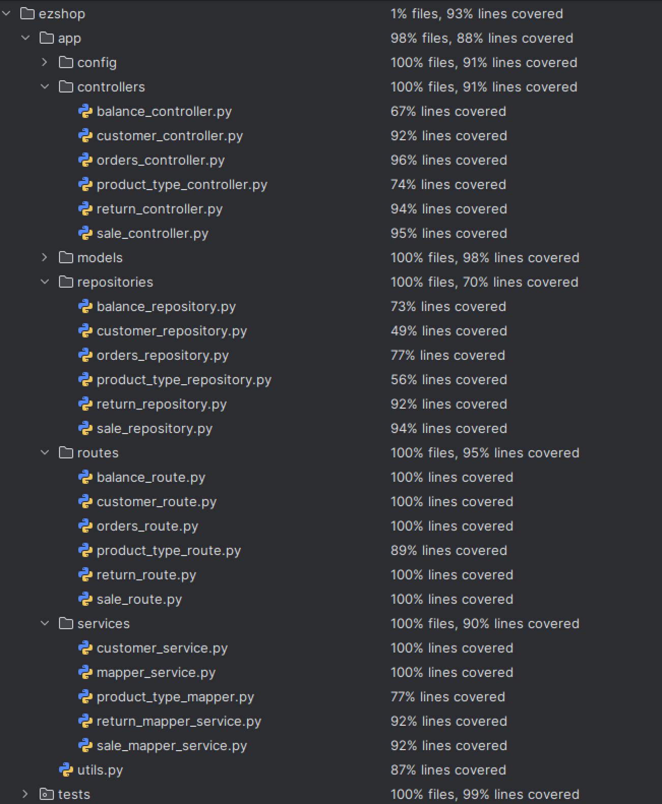

# Test Report

<The goal of this document is to explain how the application was tested, detailing how the test cases were defined and what they cover>

# Contents

- [Test Report](#test-report)
- [Contents](#contents)
- [Dependency graph](#dependency-graph)
- [Integration approach](#integration-approach)
- [Tests](#tests)
- [Coverage](#coverage)
  - [Coverage of FR](#coverage-of-fr)
  - [Coverage BB/equivalence partitioning](#coverage-Black-box)

# Dependency graph

```
                                    ┌──────────────────────────────────────┐
                                    │       FastAPI Application            │
                                    │          (main.py)                   │
                                    └──────────────┬───────────────────────┘
                                                   │
                    ┌──────────────────────────────┼──────────────────────────────┐
                    │                              │                              │
                    ▼                              ▼                              ▼
         ┌─────────────────┐          ┌─────────────────────┐        ┌──────────────────┐
         │  Middleware     │          │     Routes Layer    │        │  Error Handlers  │
         │  - CORS         │          │  (app/routes/*.py)  │        │  - AppError      │
         │  - Auth         │          └──────────┬──────────┘        │  - Exception     │
         │  - Error        │                     │                   └──────────────────┘
         └─────────────────┘                     │
                                    ┌────────────┼────────────┐
                                    │            │            │
              ┌─────────────────────┼────────────┼────────────┼─────────────────────┐
              │                     │            │            │                     │
              ▼                     ▼            ▼            ▼                     ▼
    ┌──────────────┐     ┌──────────────┐ ┌──────────┐ ┌──────────┐     ┌──────────────┐
    │ auth_route   │     │ user_route   │ │ orders_  │ │ product_ │     │ balance_     │
    │              │     │              │ │ route    │ │ type_    │     │ route        │
    └──────┬───────┘     └──────┬───────┘ └────┬─────┘ │ route    │     └──────┬───────┘
           │                    │              │       └────┬─────┘            │
           │                    │              │            │                  │
    ┌──────────────┐     ┌──────────────┐      │            │          ┌──────────────┐
    │ sale_route   │     │ return_route │      │            │          │ customer_    │
    │              │     │              │      │            │          │ route        │
    └──────┬───────┘     └──────┬───────┘      │            │          └──────┬───────┘
           │                    │              │            │                 │
           └────────────────────┴──────────────┴────────────┴─────────────────┘
                                              │
                                              ▼
                                ┌─────────────────────────┐
                                │   Controllers Layer     │
                                │  (app/controllers/)     │
                                └────────────┬────────────┘
                                             │
              ┌──────────────────────────────┼──────────────────────────────┐
              │                              │                              │
              ▼                              ▼                              ▼
    ┌──────────────────┐         ┌──────────────────┐         ┌──────────────────┐
    │ auth_controller  │         │ orders_          │         │ product_type_    │
    │                  │         │ controller       │         │ controller       │
    └────────┬─────────┘         └────────┬─────────┘         └────────┬─────────┘
             │                            │                            │
    ┌────────────────┐          ┌────────────────┐          ┌────────────────┐
    │ user_          │          │ sale_          │          │ return_        │
    │ controller     │          │ controller     │          │ controller     │
    └────────┬───────┘          └────────┬───────┘          └────────┬───────┘
             │                           │                           │
    ┌────────────────┐          ┌────────────────┐                   │
    │ balance_       │          │ customer_      │                   │
    │ controller     │          │ controller     │                   │
    └────────┬───────┘          └────────┬───────┘                   │
             │                           │                           │
             └───────────────────────────┴───────────────────────────────────┐
                                                                             │
                                                                             ▼
                                                              ┌──────────────────────────┐
                                                              │   Services Layer         │
                                                              │  (app/services/)         │
                                                              └────────────┬─────────────┘
                                                                           │
                                        ┌──────────────────────────────────┼──────────────┐
                                        │                                  │              │
                                        ▼                                  ▼              ▼
                                 ┌──────────────┐                  ┌─────────────┐  ┌──────────────┐
                                 │ auth_service │                  │ mapper_     │  │ error_       │
                                 │              │                  │ service     │  │ service      │
                                 └──────┬───────┘                  └─────┬───────┘  └──────────────┘
                                        │                                │
                                 ┌──────────────┐                  ┌─────────────┐
                                 │ customer_    │                  │ sale_mapper_│
                                 │ service      │                  │ service     │
                                 └──────┬───────┘                  └─────┬───────┘
                                        │                                │
                                        │                          ┌─────────────┐
                                        │                          │ return_     │
                                        │                          │ mapper_     │
                                        │                          │ service     │
                                        │                          └─────┬───────┘
                                        │                                │
                                        └────────────────────────────────┴────────────────┐
                                                                                          │
                                                                                          ▼
                                                                          ┌─────────────────────────────┐
                                                                          │   Repositories Layer        │
                                                                          │  (app/repositories/)        │
                                                                          └────────────┬────────────────┘
                                                                                       │
                          ┌────────────────────────────────────────────────────────────┼──────────────────┐
                          │                          │                                 │                  │
                          ▼                          ▼                                 ▼                  ▼
                   ┌─────────────┐          ┌──────────────┐                  ┌──────────────┐  ┌──────────────┐
                   │ user_       │          │ orders_      │                  │ product_type_│  │ balance_     │
                   │ repository  │          │ repository   │                  │ repository   │  │ repository   │
                   └──────┬──────┘          └──────┬───────┘                  └──────┬───────┘  └──────────────┘
                          │                        │                                 │
                   ┌──────────────┐        ┌──────────────┐                  ┌──────────────┐
                   │ sale_        │        │ return_      │                  │ customer_    │
                   │ repository   │        │ repository   │                  │ repository   │
                   └──────┬───────┘        └──────┬───────┘                  └──────┬───────┘
                          │                       │                                 │
                          │                ┌──────────────┐                         │
                          │                │ system_      │                         │
                          │                │ repository   │                         │
                          │                └──────┬───────┘                         │
                          │                       │                                 │
                          └───────────────────────┴─────────────────────────────────┘
                                                  │
                                                  ▼
                                    ┌──────────────────────────────┐
                                    │       DAO Layer              │
                                    │    (app/models/DAO/)         │
                                    └────────────┬─────────────────┘
                                                 │
              ┌──────────────────────────────────┼────────────────────────────────┐
              │                │                 │                │               │
              ▼                ▼                 ▼                ▼               ▼
       ┌──────────┐     ┌──────────┐     ┌──────────┐     ┌──────────────┐  ┌──────────┐
       │ user_dao │     │ orders_  │     │ product_ │     │ customer_dao │  │ balance_ │
       │          │     │ dao      │     │ type_dao │     │              │  │ dao      │
       └────┬─────┘     └────┬─────┘     └────┬─────┘     └───────┬──────┘  └──────────┘
            │                │                │                   │
       ┌──────────┐     ┌──────────┐     ┌──────────────┐   ┌──────────────┐
       │ sale_dao │     │ return_  │     │ loyalty_card_│   │ system_dao   │
       │          │     │ dao      │     │ dao          │   │              │
       └────┬─────┘     └────┬─────┘     └──────┬───────┘   └──────┬───────┘
            │                │                  │                  │
            └────────────────┴──────────────────┴──────────────────┘
                                                │
                                                ▼
                                    ┌──────────────────────────────┐
                                    │    Database Layer            │
                                    │  (app/database/database.py)  │
                                    │     SQLAlchemy Engine        │
                                    └────────────┬─────────────────┘
                                                 │
                                                 ▼
                                    ┌──────────────────────────────┐
                                    │    Database Models           │
                                    │  (SQLAlchemy Base.metadata)  │
                                    └──────────────────────────────┘
                                                 │
                                                 ▼
                                    ┌──────────────────────────────┐
                                    │         SQLite               │
                                    │         Database             │
                                    └──────────────────────────────┘

                    ┌────────────────────────────────────────────────┐
                    │         Cross-Cutting Concerns                 │
                    ├────────────────────────────────────────────────┤
                    │  • DTOs (app/models/DTO/)                      │
                    │  • Errors (app/models/errors/)                 │
                    │  • Config (app/config/)                        │
                    │  • Auth Core (app/core/auth.py)                │
                    │  • Utils (app/utils.py)                        │
                    └────────────────────────────────────────────────┘
```

# Integration approach

We adopted a **bottom-up integration approach** for testing the EZShop application, starting from the lowest layers and progressively integrating higher-level components.

**Integration Sequence:**

- **Step 1**: DAO Layer + Repository Layer (Integration Testing)
  - Integrated repositories with their corresponding DAOs
  - Tested data persistence and retrieval through repositories

- **Step 2**: Repository Layer + Service Layer (Integration Testing)
  - Integrated services (auth_service, customer_service, mapper_service, error_service) with repositories
  - Tested business logic with data access

- **Step 3**: Service Layer + Controller Layer (Integration Testing)
  - Integrated controllers with services
  - Tested request handling and response formatting

- **Step 4**: Controller Layer + Routes Layer + Application (API Testing)
  - Full integration testing through HTTP endpoints
  - All tests listed in the Tests section correspond to this step
  - Verified end-to-end functionality including authentication, authorization, and error handling

This approach allowed us to build confidence in lower-level components before integrating them into higher layers, making it easier to identify and isolate defects.

# Tests

<in the table below list the test cases defined For each test report the object tested, the test level (API, integration, unit) and the technique used to define the test case (BB/equivalence partitioning/ eq partitioning, BB/equivalence partitioning/ boundary, WB/ statement coverage, etc)> <split the table if needed>

| Test case name                                              |                    Object(s) tested                     | Test level |    Technique used    |
|-------------------------------------------------------------|:-------------------------------------------------------:|:----------:|:--------------------:|
| **ORDER TESTS**                                             |                                                         |            |                      |
| test_issue_order_success_as_admin                           |                      POST /orders                       |    API     |      BB/equivalence partitioning       |
| test_issue_order_success_as_shop_manager                    |                      POST /orders                       |    API     |      BB/equivalence partitioning       |
| test_issue_order_forbidden_as_cashier                       |                      POST /orders                       |    API     |      BB/equivalence partitioning       |
| test_bad_request_missing_parameters                         |                      POST /orders                       |    API     |      BB/equivalence partitioning       |
| test_issue_order_unauthenticated                            |                      POST /orders                       |    API     |      BB/equivalence partitioning       |
| test_issue_order_invalid_product_barcode                    |                      POST /orders                       |    API     |      BB/equivalence partitioning       |
| test_get_order_success_as_admin                             |                       GET /orders                       |    API     |      BB/equivalence partitioning       |
| test_get_order_success_as_shop_manager                      |                       GET /orders                       |    API     |      BB/equivalence partitioning       |
| test_get_order_forbidden_as_cashier                         |                       GET /orders                       |    API     |      BB/equivalence partitioning       |
| test_get_order_unauthenticated                              |                       GET /orders                       |    API     |      BB/equivalence partitioning       |
| test_create_and_pay_order_as_admin                          |                   POST /orders/payfor                   |    API     |      BB/equivalence partitioning       |
| test_create_and_pay_order_as_shop_manager                   |                   POST /orders/payfor                   |    API     |      BB/equivalence partitioning       |
| test_create_and_pay_order_forbidden_as_cashier              |                   POST /orders/payfor                   |    API     |      BB/equivalence partitioning       |
| test_create_and_pay_order_unauthenticated                   |                   POST /orders/payfor                   |    API     |      BB/equivalence partitioning       |
| test_create_and_pay_order_invalid_product_barcode           |                   POST /orders/payfor                   |    API     |      BB/equivalence partitioning       |
| test_create_and_pay_order_insufficient_balance              |                   POST /orders/payfor                   |    API     |      BB/equivalence partitioning       |
| test_create_and_pay_order_bad_request_missing_parameters    |                   POST /orders/payfor                   |    API     |      BB/equivalence partitioning       |
| test_pay_existing_order_success_as_admin                    |              PATCH /orders/{order_id}/pay               |    API     |      BB/equivalence partitioning       |
| test_pay_existing_order_success_as_shop_manager             |              PATCH /orders/{order_id}/pay               |    API     |      BB/equivalence partitioning       |
| test_pay_existing_order_forbidden_as_cashier                |              PATCH /orders/{order_id}/pay               |    API     |      BB/equivalence partitioning       |
| test_pay_existing_order_unauthenticated                     |              PATCH /orders/{order_id}/pay               |    API     |      BB/equivalence partitioning       |
| test_pay_existing_order_not_found                           |              PATCH /orders/{order_id}/pay               |    API     |      BB/equivalence partitioning       |
| test_pay_existing_order_invalid_id                          |              PATCH /orders/{order_id}/pay               |    API     |      BB/equivalence partitioning       |
| test_pay_existing_order_invalid_state                       |              PATCH /orders/{order_id}/pay               |    API     |      BB/equivalence partitioning       |
| test_pay_existing_order_insufficient_balance                |              PATCH /orders/{order_id}/pay               |    API     |      BB/equivalence partitioning       |
| test_record_arrival_success_as_admin                        |            PATCH /orders/{order_id}/arrival             |    API     |      BB/equivalence partitioning       |
| test_record_arrival_success_as_shop_manager                 |            PATCH /orders/{order_id}/arrival             |    API     |      BB/equivalence partitioning       |
| test_record_arrival_forbidden_as_cashier                    |            PATCH /orders/{order_id}/arrival             |    API     |      BB/equivalence partitioning       |
| test_record_arrival_unauthenticated                         |            PATCH /orders/{order_id}/arrival             |    API     |      BB/equivalence partitioning       |
| test_order_not_found                                        |            PATCH /orders/{order_id}/arrival             |    API     |      BB/equivalence partitioning       |
| test_orders_invalid_id                                      |            PATCH /orders/{order_id}/arrival             |    API     |      BB/equivalence partitioning       |
| test_record_arrival_invalid_state                           |            PATCH /orders/{order_id}/arrival             |    API     |      BB/equivalence partitioning       |
| test_product_not_found                                      |                      POST /orders                       |    API     |      BB/equivalence partitioning       |
| test_general_error_position_not_set                         |            PATCH /orders/{order_id}/arrival             |    API     |      BB/equivalence partitioning       |
| test_create_product_success_as_admin                        |                     POST /products                      |    API     |      BB/equivalence partitioning       |
| test_create_product_conflict_barcode                        |                     POST /products                      |    API     |      BB/equivalence partitioning       |
| test_create_product_invalid_barcode                         |                     POST /products                      |    API     |      BB/equivalence partitioning       |
| test_create_product_unauthenticated                         |                     POST /products                      |    API     |      BB/equivalence partitioning       |
| test_create_product_forbidden_as_cashier                    |                     POST /products                      |    API     |      BB/equivalence partitioning       |
| test_list_products_success_as_cashier                       |                      GET /products                      |    API     |      BB/equivalence partitioning       |
| test_list_products_unauthenticated                          |                      GET /products                      |    API     |      BB/equivalence partitioning       |
| test_get_product_success                                    |                   GET /products/{id}                    |    API     |      BB/equivalence partitioning       |
| test_get_product_not_found                                  |                   GET /products/{id}                    |    API     |      BB/equivalence partitioning       |
| test_get_product_unauthenticated                            |                   GET /products/{id}                    |    API     |      BB/equivalence partitioning       |
| test_update_product_success                                 |                   PUT /products/{id}                    |    API     |      BB/equivalence partitioning       |
| test_update_product_conflict_barcode                        |                   PUT /products/{id}                    |    API     |      BB/equivalence partitioning       |
| test_update_product_forbidden_as_cashier                    |                   PUT /products/{id}                    |    API     |      BB/equivalence partitioning       |
| test_delete_product_success                                 |                  DELETE /products/{id}                  |    API     |      BB/equivalence partitioning       |
| test_delete_product_forbidden_as_cashier                    |                  DELETE /products/{id}                  |    API     |      BB/equivalence partitioning       |
| test_delete_product_unauthenticated                         |                  DELETE /products/{id}                  |    API     |      BB/equivalence partitioning       |
| test_update_product_position_success                        |              PATCH /products/{id}/position              |    API     |      BB/equivalence partitioning       |
| test_update_product_position_invalid_format                 |              PATCH /products/{id}/position              |    API     |      BB/equivalence partitioning       |
| test_update_product_quantity_success                        |              PATCH /products/{id}/quantity              |    API     |      BB/equivalence partitioning       |
| test_update_product_quantity_insufficient                   |              PATCH /products/{id}/quantity              |    API     |      BB/equivalence partitioning       |
| **RETURN TESTS**                                            |                                                         |            |                      |
| test_start_return_transaction_success                       |                      POST /returns                      |    API     |      BB/equivalence partitioning       |
| test_start_return_transaction_invalid_sale_id               |                      POST /returns                      |    API     |      BB/equivalence partitioning       |
| test_start_return_transaction_requires_auth                 |                      POST /returns                      |    API     |      BB/equivalence partitioning       |
| test_start_return_transaction_sale_not_found                |                      POST /returns                      |    API     |      BB/equivalence partitioning       |
| test_start_return_transaction_invalid_state                 |                      POST /returns                      |    API     |      BB/equivalence partitioning       |
| test_list_returns_success                                   |                      GET /returns                       |    API     |      BB/equivalence partitioning       |
| test_list_returns_requires_auth                             |                      GET /returns                       |    API     |      BB/equivalence partitioning       |
| test_get_return_by_id_success                               |                    GET /returns/{id}                    |    API     |      BB/equivalence partitioning       |
| test_get_return_by_id_invalid_id                            |                    GET /returns/{id}                    |    API     |      BB/equivalence partitioning       |
| test_get_return_by_id_requires_auth                         |                    GET /returns/{id}                    |    API     |      BB/equivalence partitioning       |
| test_get_return_by_id_not_found                             |                    GET /returns/{id}                    |    API     |      BB/equivalence partitioning       |
| test_delete_return_success                                  |                  DELETE /returns/{id}                   |    API     |      BB/equivalence partitioning       |
| test_delete_return_by_id_invalid_id                         |                  DELETE /returns/{id}                   |    API     |      BB/equivalence partitioning       |
| test_delete_return_requires_auth                            |                  DELETE /returns/{id}                   |    API     |      BB/equivalence partitioning       |
| test_delete_return_not_found                                |                  DELETE /returns/{id}                   |    API     |      BB/equivalence partitioning       |
| test_delete_return_reimbursed_state                         |                  DELETE /returns/{id}                   |    API     |      BB/equivalence partitioning       |
| test_get_returns_by_sale_success                            |               GET /returns/sale/{sale_id}               |    API     |      BB/equivalence partitioning       |
| test_get_returns_by_sale_invalid_id                         |               GET /returns/sale/{sale_id}               |    API     |      BB/equivalence partitioning       |
| test_get_returns_by_sale_missing_id                         |                   GET /returns/sale/                    |    API     |      BB/equivalence partitioning       |
| test_get_returns_by_sale_requires_auth                      |               GET /returns/sale/{sale_id}               |    API     |      BB/equivalence partitioning       |
| test_add_product_to_return_success                          |                POST /returns/{id}/items                 |    API     |      BB/equivalence partitioning       |
| test_add_product_to_return_invalid_return_id                |                POST /returns/{id}/items                 |    API     |      BB/equivalence partitioning       |
| test_add_product_to_return_requires_auth                    |                POST /returns/{id}/items                 |    API     |      BB/equivalence partitioning       |
| test_add_product_to_return_not_found                        |                POST /returns/{id}/items                 |    API     |      BB/equivalence partitioning       |
| test_add_product_to_return_invalid_state                    |                POST /returns/{id}/items                 |    API     |      BB/equivalence partitioning       |
| test_add_product_to_return_invalid_quantity                 |                POST /returns/{id}/items                 |    API     |      BB/equivalence partitioning       |
| test_add_product_to_return_missing_amount                   |                POST /returns/{id}/items                 |    API     |      BB/equivalence partitioning       |
| test_add_product_to_return_quantity_exceeds_sold            |                POST /returns/{id}/items                 |    API     |      BB/equivalence partitioning       |
| test_add_product_to_return_invalid_barcode                  |                POST /returns/{id}/items                 |    API     |      BB/equivalence partitioning       |
| test_add_product_to_return_barcode_not_found                |                POST /returns/{id}/items                 |    API     |      BB/equivalence partitioning       |
| test_remove_product_from_return_success                     |               DELETE /returns/{id}/items                |    API     |      BB/equivalence partitioning       |
| test_remove_product_from_return_requires_auth               |               DELETE /returns/{id}/items                |    API     |      BB/equivalence partitioning       |
| test_remove_product_from_return_not_found                   |               DELETE /returns/{id}/items                |    API     |      BB/equivalence partitioning       |
| test_remove_product_from_return_invalid_state               |               DELETE /returns/{id}/items                |    API     |      BB/equivalence partitioning       |
| test_close_return_success                                   |                PATCH /returns/{id}/close                |    API     |      BB/equivalence partitioning       |
| test_close_return_invalid_return_id                         |                PATCH /returns/{id}/close                |    API     |      BB/equivalence partitioning       |
| test_close_return_requires_auth                             |                PATCH /returns/{id}/close                |    API     |      BB/equivalence partitioning       |
| test_close_return_not_found                                 |                PATCH /returns/{id}/close                |    API     |      BB/equivalence partitioning       |
| test_close_return_invalid_state                             |                PATCH /returns/{id}/close                |    API     |      BB/equivalence partitioning       |
| test_close_return_empty_return_is_deleted                   |                PATCH /returns/{id}/close                |    API     |      BB/equivalence partitioning       |
| test_close_return_with_products_restores_inventory          |                PATCH /returns/{id}/close                |    API     |      BB/equivalence partitioning       |
| test_reimburse_return_success                               |              PATCH /returns/{id}/reimburse              |    API     |      BB/equivalence partitioning       |
| test_reimburse_return_cashier_forbidden                     |              PATCH /returns/{id}/reimburse              |    API     |      BB/equivalence partitioning       |
| test_reimburse_return_invalid_return_id                     |              PATCH /returns/{id}/reimburse              |    API     |      BB/equivalence partitioning       |
| test_reimburse_return_requires_auth                         |              PATCH /returns/{id}/reimburse              |    API     |      BB/equivalence partitioning       |
| test_reimburse_return_not_found                             |              PATCH /returns/{id}/reimburse              |    API     |      BB/equivalence partitioning       |
| test_reimburse_return_invalid_state                         |              PATCH /returns/{id}/reimburse              |    API     |      BB/equivalence partitioning       |
| **USER TESTS**                                              |                                                         |            |                      |
| test_create_user_success_as_admin                           |                       POST /users                       |    API     |  BB/equivalence partitioning           |
| test_create_user_conflict                                   |                       POST /users                       |    API     |  BB/equivalence partitioning           |
| test_create_user_missing_fields                             |                       POST /users                       |    API     |  BB/equivalence partitioning           |
| test_create_user_unauthenticated                            |                       POST /users                       |    API     |  BB/equivalence partitioning           |
| test_create_user_forbidden_as_cashier                       |                       POST /users                       |    API     |  BB/equivalence partitioning           |
| test_list_users_success_as_admin                            |                       GET /users                        |    API     |  BB/equivalence partitioning           |
| test_list_users_unauthenticated                             |                       GET /users                        |    API     |  BB/equivalence partitioning           |
| test_list_users_forbidden_as_cashier                        |                       GET /users                        |    API     |  BB/equivalence partitioning           |
| test_get_user_success                                       |                  GET /users/{user_id}                   |    API     |  BB/equivalence partitioning           |
| test_get_user_invalid_id                                    |                  GET /users/{user_id}                   |    API     |  BB/equivalence partitioning           |
| test_get_user_not_found                                     |                  GET /users/{user_id}                   |    API     |  BB/equivalence partitioning           |
| test_get_user_unauthenticated                               |                  GET /users/{user_id}                   |    API     |  BB/equivalence partitioning           |
| test_get_user_forbidden_as_cashier                          |                  GET /users/{user_id}                   |    API     |  BB/equivalence partitioning           |
| test_update_user_success                                    |                  PUT /users/{user_id}                   |    API     |  BB/equivalence partitioning           |
| test_update_user_invalid_input                              |                  PUT /users/{user_id}                   |    API     |  BB/equivalence partitioning           |
| test_update_user_not_found                                  |                  PUT /users/{user_id}                   |    API     |  BB/equivalence partitioning           |
| test_update_user_conflict                                   |                  PUT /users/{user_id}                   |    API     |  BB/equivalence partitioning           |
| test_update_user_unauthenticated                            |                  PUT /users/{user_id}                   |    API     |  BB/equivalence partitioning           |
| test_update_user_forbidden_as_cashier                       |                  PUT /users/{user_id}                   |    API     |  BB/equivalence partitioning           |
| test_delete_user_success                                    |                 DELETE /users/{user_id}                 |    API     |  BB/equivalence partitioning           |
| test_delete_user_unauthenticated                            |                 DELETE /users/{user_id}                 |    API     |  BB/equivalence partitioning           |
| test_delete_user_forbidden_as_cashier                       |                 DELETE /users/{user_id}                 |    API     |  BB/equivalence partitioning           |
| test_delete_user_not_found                                  |                 DELETE /users/{user_id}                 |    API     |  BB/equivalence partitioning           |
| test_create_and_list_user                                   |                    POST & GET /users                    |    API     |   WB/path coverage   |
| test_multiple_user_types_creation                           |                       POST /users                       |    API     |  BB/equivalence partitioning           |
| test_invalid_user_type                                      |                       POST /users                       |    API     |  BB/equivalence partitioning           |
| test_weak_password_validation                               |                       POST /users                       |    API     |     BB/boundary      |
| **ACCOUNTING TESTS**                                        |                                                         |            |                      |
| test_reset_balance_as_admin_success                         |                   POST /balance/reset                   |    API     |  BB/equivalence partitioning           |
| test_reset_balance_unauthenticated                          |                   POST /balance/reset                   |    API     |  BB/equivalence partitioning           |
| test_reset_balance_unauthorized                             |                   POST /balance/reset                   |    API     |  BB/equivalence partitioning           |
| test_internal_server_error_on_reset                         |                   POST /balance/reset                   |    API     | WB/decision coverage |
| test_set_balance_as_admin_success                           |                    POST /balance/set                    |    API     |  BB/equivalence partitioning           |
| test_set_balance_unauthenticated                            |                    POST /balance/set                    |    API     |  BB/equivalence partitioning           |
| test_set_balance_unauthorized                               |                    POST /balance/set                    |    API     |  BB/equivalence partitioning           |
| test_set_balance_negative_amount                            |                    POST /balance/set                    |    API     |     BB/boundary      |
| test_set_balance_invalid_amount                             |                    POST /balance/set                    |    API     |  BB/equivalence partitioning           |
| test_internal_server_error_on_set                           |                    POST /balance/set                    |    API     | WB/decision coverage |
| test_get_balance_as_admin_success                           |                      GET /balance                       |    API     |  BB/equivalence partitioning           |
| test_get_balance_unauthenticated                            |                      GET /balance                       |    API     |  BB/equivalence partitioning           |
| test_get_balance_unauthorized                               |                      GET /balance                       |    API     |  BB/equivalence partitioning           |
| **CUSTOMER TESTS**                                          |                                                         |            |                      |
| test_create_loyalty_card                                    |                  POST /customers/cards                  |    API     |      BB/equivalence partitioning       |
| test_create_loyalty_card_unauthenticated_fail               |                  POST /customers/cards                  |    API     |      BB/equivalence partitioning       |
| test_create_customer_name_only                              |                     POST /customers                     |    API     |      BB/equivalence partitioning       |
| test_create_customer_name_only_unauthenticated_fail         |                     POST /customers                     |    API     |      BB/equivalence partitioning       |
| test_create_customer_no_name_fail                           |                     POST /customers                     |    API     |      BB/equivalence partitioning       |
| test_create_customer_empty_body_fail                        |                     POST /customers                     |    API     |      BB/equivalence partitioning       |
| test_create_customer_with_id                                |                     POST /customers                     |    API     |      BB/equivalence partitioning       |
| test_create_customer_with_card_without_points               |                     POST /customers                     |    API     |      BB/equivalence partitioning       |
| test_create_customer_with_card_with_points                  |                     POST /customers                     |    API     |      BB/equivalence partitioning       |
| test_create_customer_with_an_already_attached_card_fail     |                     POST /customers                     |    API     |      BB/equivalence partitioning       |
| test_create_customer_with_nonexistent_card_fail             |                     POST /customers                     |    API     |      BB/equivalence partitioning       |
| test_create_customer_with_invalid_card_id_fail              |                     POST /customers                     |    API     |      BB/equivalence partitioning       |
| test_list_all_customers_as_admin                            |                     GET /customers                      |    API     |      BB/equivalence partitioning       |
| test_list_all_customers_unauthenticated_fail                |                     GET /customers                      |    API     |      BB/equivalence partitioning       |
| test_list_all_customers_after_creating_new_customer         |                     GET /customers                      |    API     |      BB/equivalence partitioning       |
| test_list_all_customers_after_deleting_customer             |                     GET /customers                      |    API     |      BB/equivalence partitioning       |
| test_get_a_customer_found                                   |              GET /customers/{customer_id}               |    API     |      BB/equivalence partitioning       |
| test_get_a_customer_unauthenticated_fail                    |              GET /customers/{customer_id}               |    API     |      BB/equivalence partitioning       |
| test_get_a_customer_invalid_id_fail                         |              GET /customers/{customer_id}               |    API     |      BB/equivalence partitioning       |
| test_get_a_customer_not_found_fail                          |              GET /customers/{customer_id}               |    API     |      BB/equivalence partitioning       |
| test_update_customer_name_only                              |              PUT /customers/{customer_id}               |    API     |      BB/equivalence partitioning       |
| test_update_customer_empty_name                             |              PUT /customers/{customer_id}               |    API     |      BB/equivalence partitioning       |
| test_update_customer_unauthenticated                        |              PUT /customers/{customer_id}               |    API     |      BB/equivalence partitioning       |
| test_update_customer_null_card                              |              PUT /customers/{customer_id}               |    API     |      BB/equivalence partitioning       |
| test_update_customer_not_found                              |              PUT /customers/{customer_id}               |    API     |      BB/equivalence partitioning       |
| test_update_customer_card_not_found                         |              PUT /customers/{customer_id}               |    API     |      BB/equivalence partitioning       |
| test_update_customer_card_already_attached                  |              PUT /customers/{customer_id}               |    API     |      BB/equivalence partitioning       |
| test_delete_customer                                        |             DELETE /customers/{customer_id}             |    API     |      BB/equivalence partitioning       |
| test_delete_customer_unauthenticated                        |             DELETE /customers/{customer_id}             |    API     |      BB/equivalence partitioning       |
| test_delete_customer_not_found                              |             DELETE /customers/{customer_id}             |    API     |      BB/equivalence partitioning       |
| test_attach_card                                            |  PATCH /customers/{customer_id}/attach-card/{card_id}   |    API     |      BB/equivalence partitioning       |
| test_attach_card_unauthenticated                            |  PATCH /customers/{customer_id}/attach-card/{card_id}   |    API     |      BB/equivalence partitioning       |
| test_attach_card_invalid_id                                 |  PATCH /customers/{customer_id}/attach-card/{card_id}   |    API     |      BB/equivalence partitioning       |
| test_attach_card_empty_id                                   |  PATCH /customers/{customer_id}/attach-card/{card_id}   |    API     |      BB/equivalence partitioning       |
| test_attach_nonexistent_card                                |  PATCH /customers/{customer_id}/attach-card/{card_id}   |    API     |      BB/equivalence partitioning       |
| test_attach_card_to_nonexistent_customer                    |  PATCH /customers/{customer_id}/attach-card/{card_id}   |    API     |      BB/equivalence partitioning       |
| test_attach_already_attached_card                           |  PATCH /customers/{customer_id}/attach-card/{card_id}   |    API     |      BB/equivalence partitioning       |
| test_modify_card_points                                     |            PATCH /customers/cards/{card_id}             |    API     |      BB/equivalence partitioning       |
| test_modify_card_points_unauthenticated                     |            PATCH /customers/cards/{card_id}             |    API     |      BB/equivalence partitioning       |
| test_modify_invalid_card_points                             |            PATCH /customers/cards/{card_id}             |    API     |      BB/equivalence partitioning       |
| test_modify_nonexistent_card_points                         |            PATCH /customers/cards/{card_id}             |    API     |      BB/equivalence partitioning       |
| test_modify_card_insufficient_points                        |            PATCH /customers/cards/{card_id}             |    API     |      BB/equivalence partitioning       |
| **SALES TESTS**                                             |                                                         |            |                      |
| test_create_sale                                            |                       POST /sales                       |    API     |      BB/equivalence partitioning       |
| test_create_sale_unauthenticated                            |                       POST /sales                       |    API     |      BB/equivalence partitioning       |
| test_get_all_sale_transactions                              |                       GET /sales                        |    API     |      BB/equivalence partitioning       |
| test_get_all_sale_transactions_unauthenticated              |                       GET /sales                        |    API     |      BB/equivalence partitioning       |
| test_get_sale_by_id                                         |                  GET /sales/{sale_id}                   |    API     |      BB/equivalence partitioning       |
| test_get_sale_by_invalid_id                                 |                  GET /sales/{sale_id}                   |    API     |      BB/equivalence partitioning       |
| test_get_sale_by_missing_id                                 |                  GET /sales/{sale_id}                   |    API     |      BB/equivalence partitioning       |
| test_get_sale_by_id_unauthenticated                         |                  GET /sales/{sale_id}                   |    API     |      BB/equivalence partitioning       |
| test_get_sale_by_nonexistent_id                             |                  GET /sales/{sale_id}                   |    API     |      BB/equivalence partitioning       |
| test_delete_sale_by_id                                      |                 DELETE /sales/{sale_id}                 |    API     |      BB/equivalence partitioning       |
| test_delete_sale_by_invalid_id                              |                 DELETE /sales/{sale_id}                 |    API     |      BB/equivalence partitioning       |
| test_delete_sale_by_missing_id                              |                 DELETE /sales/{sale_id}                 |    API     |      BB/equivalence partitioning       |
| test_delete_sale_by_id_unauthenticated                      |                 DELETE /sales/{sale_id}                 |    API     |      BB/equivalence partitioning       |
| test_delete_sale_by_nonexistent_id                          |                 DELETE /sales/{sale_id}                 |    API     |      BB/equivalence partitioning       |
| test_delete_paid_sale_by_id                                 |                 DELETE /sales/{sale_id}                 |    API     |      BB/equivalence partitioning       |
| test_add_product_to_open_sale                               |               POST /sales/{sale_id}/items               |    API     |      BB/equivalence partitioning       |
| test_add_invalid_barcode_product_to_open_sale               |               POST /sales/{sale_id}/items               |    API     |      BB/equivalence partitioning       |
| test_add_empty_barcode_product_to_open_sale                 |               POST /sales/{sale_id}/items               |    API     |      BB/equivalence partitioning       |
| test_add_nonexistent_product_to_open_sale                   |               POST /sales/{sale_id}/items               |    API     |      BB/equivalence partitioning       |
| test_add_product_to_invalid_sale_id                         |               POST /sales/{sale_id}/items               |    API     |      BB/equivalence partitioning       |
| test_add_product_to_empty_sale_id                           |               POST /sales/{sale_id}/items               |    API     |      BB/equivalence partitioning       |
| test_add_product_to_open_sale_unauthenticated               |               POST /sales/{sale_id}/items               |    API     |      BB/equivalence partitioning       |
| test_add_product_to_open_sale_insufficient_stock            |               POST /sales/{sale_id}/items               |    API     |      BB/equivalence partitioning       |
| test_add_product_to_nonexistent_sale_id                     |               POST /sales/{sale_id}/items               |    API     |      BB/equivalence partitioning       |
| test_add_product_to_pending_sale_id                         |               POST /sales/{sale_id}/items               |    API     |      BB/equivalence partitioning       |
| test_add_product_to_closed_sale_id                          |               POST /sales/{sale_id}/items               |    API     |      BB/equivalence partitioning       |
| test_reduce_product_quantity_from_open_sale                 |              DELETE /sales/{sale_id}/items              |    API     |      BB/equivalence partitioning       |
| test_remove_product_quantity_from_open_sale                 |              DELETE /sales/{sale_id}/items              |    API     |      BB/equivalence partitioning       |
| test_remove_product_quantity_from_open_sale_unauthenticated |              DELETE /sales/{sale_id}/items              |    API     |      BB/equivalence partitioning       |
| test_remove_product_invalid_quantity_from_open_sale         |              DELETE /sales/{sale_id}/items              |    API     |      BB/equivalence partitioning       |
| test_remove_product_invalid_sale_id_from_open_sale          |              DELETE /sales/{sale_id}/items              |    API     |      BB/equivalence partitioning       |
| test_remove_product_from_nonexistent_sale                   |              DELETE /sales/{sale_id}/items              |    API     |      BB/equivalence partitioning       |
| test_remove_product_not_found_from_open_sale                |              DELETE /sales/{sale_id}/items              |    API     |      BB/equivalence partitioning       |
| test_reduce_product_quantity_from_pending_sale              |              DELETE /sales/{sale_id}/items              |    API     |      BB/equivalence partitioning       |
| test_reduce_product_quantity_from_closed_sale               |              DELETE /sales/{sale_id}/items              |    API     |      BB/equivalence partitioning       |
| test_apply_discount_to_open_sale                            |             PATCH /sales/{sale_id}/discount             |    API     |      BB/equivalence partitioning       |
| test_apply_discount_to_invalid_sale_id                      |             PATCH /sales/{sale_id}/discount             |    API     |      BB/equivalence partitioning       |
| test_apply_invalid_discount_to_open_sale                    |             PATCH /sales/{sale_id}/discount             |    API     |      BB/equivalence partitioning       |
| test_apply_discount_unauthenticated                         |             PATCH /sales/{sale_id}/discount             |    API     |      BB/equivalence partitioning       |
| test_apply_discount_to_nonexistent_sale                     |             PATCH /sales/{sale_id}/discount             |    API     |      BB/equivalence partitioning       |
| test_apply_discount_to_pending_sale                         |             PATCH /sales/{sale_id}/discount             |    API     |      BB/equivalence partitioning       |
| test_apply_discount_to_closed_sale                          |             PATCH /sales/{sale_id}/discount             |    API     |      BB/equivalence partitioning       |
| test_apply_discount_to_product_in_open_sale                 | PATCH /sales/{sale_id}/items/{product_barcode}/discount |    API     |      BB/equivalence partitioning       |
| test_apply_discount_to_product_in_invalid_sale              | PATCH /sales/{sale_id}/items/{product_barcode}/discount |    API     |      BB/equivalence partitioning       |
| test_apply_invalid_discount_to_product_in_open_sale         | PATCH /sales/{sale_id}/items/{product_barcode}/discount |    API     |      BB/equivalence partitioning       |
| test_apply_discount_to_product_in_open_sale_unauthenticated | PATCH /sales/{sale_id}/items/{product_barcode}/discount |    API     |      BB/equivalence partitioning       |
| test_apply_discount_to_product_in_nonexistent_sale          | PATCH /sales/{sale_id}/items/{product_barcode}/discount |    API     |      BB/equivalence partitioning       |
| test_apply_discount_to_product_to_pending_sale              | PATCH /sales/{sale_id}/items/{product_barcode}/discount |    API     |      BB/equivalence partitioning       |
| test_apply_discount_to_product_to_closed_sale               | PATCH /sales/{sale_id}/items/{product_barcode}/discount |    API     |      BB/equivalence partitioning       |
| test_close_open_sale_transaction                            |              PATCH /sales/{sale_id}/close               |    API     |      BB/equivalence partitioning       |
| test_close_open_empty_sale_transaction                      |              PATCH /sales/{sale_id}/close               |    API     |      BB/equivalence partitioning       |
| test_close_sale_transaction_invalid_id                      |              PATCH /sales/{sale_id}/close               |    API     |      BB/equivalence partitioning       |
| test_close_sale_transaction_empty_id                        |              PATCH /sales/{sale_id}/close               |    API     |      BB/equivalence partitioning       |
| test_close_open_sale_unauthenticated                        |              PATCH /sales/{sale_id}/close               |    API     |      BB/equivalence partitioning       |
| test_close_nonexistent_sale                                 |              PATCH /sales/{sale_id}/close               |    API     |      BB/equivalence partitioning       |
| test_close_pending_sale                                     |              PATCH /sales/{sale_id}/close               |    API     |      BB/equivalence partitioning       |
| test_close_already_closed_sale                              |              PATCH /sales/{sale_id}/close               |    API     |      BB/equivalence partitioning       |
| test_pay_pending_sale                                       |               PATCH /sales/{sale_id}/pay                |    API     |      BB/equivalence partitioning       |
| test_pay_invalid_id_sale                                    |               PATCH /sales/{sale_id}/pay                |    API     |      BB/equivalence partitioning       |
| test_pay_missing_id_sale                                    |               PATCH /sales/{sale_id}/pay                |    API     |      BB/equivalence partitioning       |
| test_pay_sale_unauthenticated                               |               PATCH /sales/{sale_id}/pay                |    API     |      BB/equivalence partitioning       |
| test_pay_sale_not_found                                     |               PATCH /sales/{sale_id}/pay                |    API     |      BB/equivalence partitioning       |
| test_pay_open_sale                                          |               PATCH /sales/{sale_id}/pay                |    API     |      BB/equivalence partitioning       |
| test_pay_closed_sale                                        |               PATCH /sales/{sale_id}/pay                |    API     |      BB/equivalence partitioning       |
| test_compute_points_sale                                    |               GET /sales/{sale_id}/points               |    API     |      BB/equivalence partitioning       |
| test_compute_points_invalid_id_sale                         |               GET /sales/{sale_id}/points               |    API     |      BB/equivalence partitioning       |
| test_compute_points_missing_id_sale                         |               GET /sales/{sale_id}/points               |    API     |      BB/equivalence partitioning       |
| test_compute_points_sale_unauthenticated                    |               GET /sales/{sale_id}/points               |    API     |      BB/equivalence partitioning       |
| test_compute_points_sale_not_found                          |               GET /sales/{sale_id}/points               |    API     |      BB/equivalence partitioning       |
| test_compute_points_open_sale                               |               GET /sales/{sale_id}/points               |    API     |      BB/equivalence partitioning       |
| test_compute_points_pending_sale                            |               GET /sales/{sale_id}/points               |    API     |      BB/equivalence partitioning       |

# Coverage

## Coverage of FR

<Report in the following table the coverage of functional requirements and scenarios (from official requirements)>

| Functional Requirement or scenario                                         | Test(s)                                                                                                                                                                                                                                                                                                                                                                                                                                                                                                                                                                                                                                                                                                |
| :------------------------------------------------------------------------- | :----------------------------------------------------------------------------------------------------------------------------------------------------------------------------------------------------------------------------------------------------------------------------------------------------------------------------------------------------------------------------------------------------------------------------------------------------------------------------------------------------------------------------------------------------------------------------------------------------------------------------------------------------------------------------------------------------- |
| Scenario 4-1 - Create customer record                                      | test_create_customer_name_only, test_create_customer_name_only_unauthenticated_fail, test_create_customer_no_name_fail, test_create_customer_empty_body_fail, test_create_customer_with_id, test_create_customer_with_card_without_points, test_create_customer_with_card_with_points, test_create_customer_with_an_already_attached_card_fail, test_create_customer_with_nonexistent_card_fail, test_create_customer_with_invalid_card_id_fail                                                                                                                                                                                                                                                        |
| Scenario 4-2 - Attach Loyalty card to customer record                      | test_attach_card, test_attach_card_unauthenticated, test_attach_card_invalid_id, test_attach_card_empty_id, test_attach_nonexistent_card, test_attach_card_to_nonexistent_customer, test_attach_already_attached_card                                                                                                                                                                                                                                                                                                                                                                                                                                                                                  |
| Scenario 4-3 - Detach Loyalty card from customer record                    | test_update_customer_null_card                                                                                                                                                                                                                                                                                                                                                                                                                                                                                                                                                                                                                                                                         |
| Scenario 4-4 - Update customer record                                      | test_update_customer_name_only, test_update_customer_empty_name, test_update_customer_unauthenticated, test_update_customer_null_card, test_update_customer_not_found, test_update_customer_card_not_found, test_update_customer_card_already_attached                                                                                                                                                                                                                                                                                                                                                                                                                                                 |
| FR6.1 - Start a sale                                                       | test_create_sale, test_create_sale_unauthenticated                                                                                                                                                                                                                                                                                                                                                                                                                                                                                                                                                                                                                                                     |
| FR6.2 - Add a product to a sale                                            | test_add_product_to_open_sale, test_add_invalid_barcode_product_to_open_sale, test_add_empty_barcode_product_to_open_sale, test_add_nonexistent_product_to_open_sale, test_add_product_to_invalid_sale_id, test_add_product_to_empty_sale_id, test_add_product_to_open_sale_unauthenticated, test_add_product_to_open_sale_insufficient_stock, test_add_product_to_nonexistent_sale_id, test_add_product_to_pending_sale_id, test_add_product_to_closed_sale_id                                                                                                                                                                                                                                        |
| FR6.3 - Delete a product from a sale                                       | test_reduce_product_quantity_from_open_sale, test_remove_product_quantity_from_open_sale, test_remove_product_quantity_from_open_sale_unauthenticated, test_remove_product_invalid_quantity_from_open_sale, test_remove_product_invalid_sale_id_from_open_sale, test_remove_product_from_nonexistent_sale, test_remove_product_not_found_from_open_sale, test_reduce_product_quantity_from_pending_sale, test_reduce_product_quantity_from_closed_sale                                                                                                                                                                                                                                                 |
| FR6.4 - Apply discount rate to a sale                                      | test_apply_discount_to_open_sale, test_apply_discount_to_invalid_sale_id, test_apply_invalid_discount_to_open_sale, test_apply_discount_unauthenticated, test_apply_discount_to_nonexistent_sale, test_apply_discount_to_pending_sale, test_apply_discount_to_closed_sale                                                                                                                                                                                                                                                                                                                                                                                                                              |
| FR6.5 - Apply discount rate to a product type                              | test_apply_discount_to_product_in_open_sale, test_apply_discount_to_product_in_invalid_sale, test_apply_invalid_discount_to_product_in_open_sale, test_apply_discount_to_product_in_open_sale_unauthenticated, test_apply_discount_to_product_in_nonexistent_sale, test_apply_discount_to_product_to_pending_sale, test_apply_discount_to_product_to_closed_sale                                                                                                                                                                                                                                                                                                                                       |
| FR6.6 - Compute points for a sale                                          | test_compute_points_sale, test_compute_points_invalid_id_sale, test_compute_points_missing_id_sale, test_compute_points_sale_unauthenticated, test_compute_points_sale_not_found, test_compute_points_open_sale, test_compute_points_pending_sale                                                                                                                                                                                                                                                                                                                                                                                                                                                      |
| FR6.10 - Close a sale transaction                                          | test_close_open_sale_transaction, test_close_open_empty_sale_transaction, test_close_sale_transaction_invalid_id, test_close_sale_transaction_empty_id, test_close_open_sale_unauthenticated, test_close_nonexistent_sale, test_close_pending_sale, test_close_already_closed_sale                                                                                                                                                                                                                                                                                                                                                                                                                     |
| FR6.11 - Rollback or commit a closed sale transaction                      | test_pay_pending_sale, test_pay_invalid_id_sale, test_pay_missing_id_sale, test_pay_sale_unauthenticated, test_pay_sale_not_found, test_pay_open_sale, test_pay_closed_sale                                                                                                                                                                                                                                                                                                                                                                                                                                                                                                                            |
| FR5.1 - Define or modify a customer                                        | test_create_customer_name_only, test_create_customer_name_only_unauthenticated_fail, test_create_customer_no_name_fail, test_create_customer_empty_body_fail, test_create_customer_with_id, test_create_customer_with_card_without_points, test_create_customer_with_card_with_points, test_create_customer_with_an_already_attached_card_fail, test_create_customer_with_nonexistent_card_fail, test_create_customer_with_invalid_card_id_fail,test_update_customer_name_only, test_update_customer_empty_name, test_update_customer_unauthenticated, test_update_customer_null_card, test_update_customer_not_found, test_update_customer_card_not_found, test_update_customer_card_already_attached |
| FR5.2 - Delete a customer                                                  | test_delete_customer, test_delete_customer_unauthenticated, test_delete_customer_not_found                                                                                                                                                                                                                                                                                                                                                                                                                                                                                                                                                                                                             |
| FR5.3 - Search a customer                                                  | test_get_a_customer_found, test_get_a_customer_unauthenticated_fail, test_get_a_customer_invalid_id_fail, test_get_a_customer_not_found_fail                                                                                                                                                                                                                                                                                                                                                                                                                                                                                                                                                           |
| FR5.4 - List all customers                                                 | test_list_all_customers, test_list_all_customers_unauthenticated_fail, test_list_all_customers_after_creating_new_customer, test_list_all_customers_after_deleting_customer                                                                                                                                                                                                                                                                                                                                                                                                                                                                                                                            |
| FR5.5 - Create a loyalty card                                              | test_create_loyalty_card, test_create_loyalty_card_unauthenticated_fail                                                                                                                                                                                                                                                                                                                                                                                                                                                                                                                                                                                                                                |
| FR5.6 - Attach loyalty card to a customer                                  | test_attach_card, test_attach_card_unauthenticated, test_attach_card_invalid_id, test_attach_card_empty_id, test_attach_nonexistent_card, test_attach_card_to_nonexistent_customer, test_attach_already_attached_card                                                                                                                                                                                                                                                                                                                                                                                                                                                                                  |
| FR5.7 - Modify points on a loyalty card                                    | test_modify_card_points, test_modify_card_points_unauthenticated, test_modify_invalid_card_points, test_modify_nonexistent_card_points, test_modify_card_insufficient_points                                                                                                                                                                                                                                                                                                                                                                                                                                                                                                                           |
| FR4.4 - Send and pay an order for a product type                           | test_issue_order_success_as_admin, test_issue_order_success_as_shop_manager, test_create_and_pay_order_as_admin, test_create_and_pay_order_as_shop_manager                                                                                                                                                                                                                                                                                                                                                                                                                                                                                                                                             |
| FR4.5 - Pay an issued reorder warning                                      | test_pay_existing_order_success_as_admin, test_pay_existing_order_success_as_shop_manager                                                                                                                                                                                                                                                                                                                                                                                                                                                                                                                                                                                                              |
| FR4.6 - Record order arrival                                               | test_record_arrival_success_as_admin, test_record_arrival_success_as_shop_manager                                                                                                                                                                                                                                                                                                                                                                                                                                                                                                                                                                                                                      |
| FR4.7 - List all orders (issued, payed, completed)                         | test_get_order_success_as_admin, test_get_order_success_as_shop_manager                                                                                                                                                                                                                                                                                                                                                                                                                                                                                                                                                                                                                                |
| Scenario 3-1 - Order of product type X issued                              | test_issue_order_success_as_admin, test_issue_order_success_as_shop_manager                                                                                                                                                                                                                                                                                                                                                                                                                                                                                                                                                                                                                            |
| Scenario 3-2 - Order of product type X payed                               | test_pay_existing_order_success_as_admin, test_pay_existing_order_success_as_shop_manager, test_create_and_pay_order_as_admin, test_create_and_pay_order_as_shop_manager                                                                                                                                                                                                                                                                                                                                                                                                                                                                                                                               |
| Scenario 3-3 - Record order of product type X arrival                      | test_record_arrival_success_as_admin, test_record_arrival_success_as_shop_manager                                                                                                                                                                                                                                                                                                                                                                                                                                                                                                                                                                                                                      |
| FR4.1 – Create a new product type                                          | test_create_product_success_as_admin                                                                                                                                                                                                                                                                                                                                                                                                                                                                                                                                                                                                                                                                   |
| FR4.2 – List all product types                                             | test_list_products_success_as_cashier                                                                                                                                                                                                                                                                                                                                                                                                                                                                                                                                                                                                                                                                  |
| FR4.3 – Get product type by id                                             | test_get_product_success, test_get_product_not_found                                                                                                                                                                                                                                                                                                                                                                                                                                                                                                                                                                                                                                                   |
| FR4.8 – Update product type information                                    | test_update_product_success, test_update_product_conflict_barcode                                                                                                                                                                                                                                                                                                                                                                                                                                                                                                                                                                                                                                      |
| FR4.9 – Delete product type                                                | test_delete_product_success                                                                                                                                                                                                                                                                                                                                                                                                                                                                                                                                                                                                                                                                            |
| FR4.10 – Update product position                                           | test_update_product_position_success, test_update_product_position_invalid_format                                                                                                                                                                                                                                                                                                                                                                                                                                                                                                                                                                                                                      |
| FR4.11 – Update product quantity                                           | test_update_product_quantity_success, test_update_product_quantity_insufficient                                                                                                                                                                                                                                                                                                                                                                                                                                                                                                                                                                                                                        |
| FR6.12 - Start a return transaction                                        | test_start_return_transaction_success, test_start_return_transaction_invalid_sale_id, test_start_return_transaction_sale_not_found, test_start_return_transaction_invalid_state                                                                                                                                                                                                                                                                                                                                                                                                                                                                                                                        |
| FR6.13 - Return a product listed in a sale transaction                     | test_add_product_to_return_success, test_add_product_to_return_invalid_quantity, test_add_product_to_return_quantity_exceeds_sold, test_add_product_to_return_invalid_barcode, test_add_product_to_return_barcode_not_found, test_remove_product_from_return_success, test_add_product_to_return_invalid_state, test_remove_product_from_return_invalid_state                                                                                                                                                                                                                                                                                                                                          |
| FR6.14 - Close a return transaction                                        | test_close_return_success, test_close_return_empty_return_is_deleted, test_close_return_with_products_restores_inventory, test_close_return_invalid_state                                                                                                                                                                                                                                                                                                                                                                                                                                                                                                                                              |
| FR6.15 - Rollback or commit a closed return transaction                    | test_reimburse_return_success, test_reimburse_return_cashier_forbidden, test_reimburse_return_invalid_state, test_delete_return_success, test_delete_return_reimbursed_state                                                                                                                                                                                                                                                                                                                                                                                                                                                                                                                           |
| Scenario 8-1 - Return transaction of product type X completed, credit card | test_start_return_transaction_success, test_add_product_to_return_success, test_close_return_success, test_reimburse_return_success                                                                                                                                                                                                                                                                                                                                                                                                                                                                                                                                                                    |
| Scenario 8-2 - Return transaction of product type X completed, cash        | test_start_return_transaction_success, test_add_product_to_return_success, test_close_return_success, test_delete_return_success                                                                                                                                                                                                                                                                                                                                                                                                                                                                                                                                                                       |
| FR1.1 - Define a new user, or modify an existing user                      | test_create_user_success_as_admin, test_create_user_conflict, test_create_user_missing_fields, test_create_user_unauthenticated, test_create_user_forbidden_as_cashier, test_update_user_success, test_update_user_invalid_input, test_update_user_not_found, test_update_user_conflict, test_update_user_unauthenticated, test_update_user_forbidden_as_cashier                                                                                                                                                                                                                                                                                                                                       |
| FR1.2 - Delete a user                                                      | test_delete_user_success, test_delete_user_unauthenticated, test_delete_user_forbidden_as_cashier, test_delete_user_not_found                                                                                                                                                                                                                                                                                                                                                                                                                                                                                                                                                                          |
| FR1.3 - List all users                                                     | test_list_users_success_as_admin, test_list_users_unauthenticated, test_list_users_forbidden_as_cashier                                                                                                                                                                                                                                                                                                                                                                                                                                                                                                                                                                                                |
| FR1.4 - Search a user                                                      | test_get_user_success, test_get_user_invalid_id, test_get_user_not_found, test_get_user_unauthenticated, test_get_user_forbidden_as_cashier                                                                                                                                                                                                                                                                                                                                                                                                                                                                                                                                                            |
| Scenario 2-1 - Create user and define rights                               | test_create_user_success_as_admin, test_create_user_conflict, test_create_user_missing_fields, test_create_user_unauthenticated, test_create_user_forbidden_as_cashier                                                                                                                                                                                                                                                                                                                                                                                                                                                                                                                                 |
| Scenario 2-2 - Delete user                                                 | test_delete_user_success, test_delete_user_unauthenticated, test_delete_user_forbidden_as_cashier, test_delete_user_not_found                                                                                                                                                                                                                                                                                                                                                                                                                                                                                                                                                                          |
| Scenario 2-3 - Modify user rights                                          | test_update_user_success, test_update_user_invalid_input, test_update_user_not_found, test_update_user_conflict, test_update_user_unauthenticated, test_update_user_forbidden_as_cashier                                                                                                                                                                                                                                                                                                                                                                                                                                                                                                               |
| FR8.1 Record debit                                                         | test_set_balance_as_admin_success, test_set_balance_unauthorized, test_set_balance_unauthenticated, test_set_balance_negative_amount, test_set_balance_invalid_amount, test_internal_server_error_on_set                                                                                                                                                                                                                                                                                                                                                                                                                                                                                               |
| FR8.2 Record credit                                                        | test_set_balance_as_admin_success, test_set_balance_unauthorized, test_set_balance_unauthenticated, test_set_balance_negative_amount, test_set_balance_invalid_amount, test_internal_server_error_on_set                                                                                                                                                                                                                                                                                                                                                                                                                                                                                               |
| FR8.4 - Compute balance                                                    | test_get_balance_as_admin_success, test_get_balance_unauthenticated, test_get_balance_unauthorized                                                                                                                                                                                                                                                                                                                                                                                                                                                                                                                                                                                                     |
| Scenario 6-1 - Sale of product type X completed                            | test_pay_pending_sale                                                                                                                                                                                                                                                                                                                                                                                                                                                                                                                                                                                                                                                                                  |
| Scenario 6-2 - Sale of product type X with product discount                | test_pay_pending_sale                                                                                                                                                                                                                                                                                                                                                                                                                                                                                                                                                                                                                                                                                  |

## Coverage BB/equivalence partitioning

Report here the screenshot of coverage values obtained with PyTest

